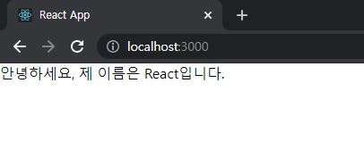
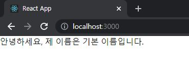
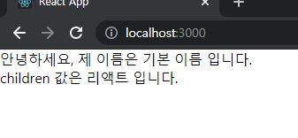
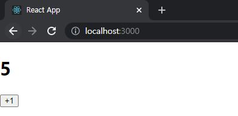
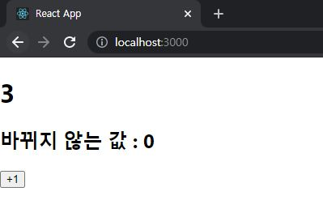
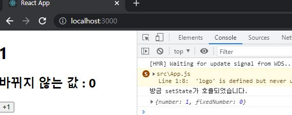
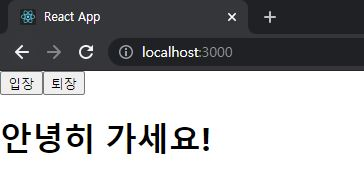
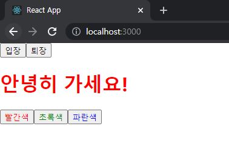

# ReactJS-03


## 1. 클래스형 컴포넌트

- 컴포넌트를 선언하는 방식은 두 가지가 있다.

  - **함수형 컴포넌트**

   ```react
   // 함수형 컴포넌트
   // App.js
   
   import React from 'react';
   import './App.css';
   
   function App() {
       const name = '리액트';
       return <div className='react'>{name}</div>
   }
   export default App;
   ```

  - **클래스형 컴포넌트**

   ```react
   // 클래스형 컴포넌트
   // App.js
   
   import React, { Component } from 'react';
   
   class App extends Component {
       render() {
           const name = 'react';
           return <div className='react'>{name}</div>
       } 
   }
   export default App;
   ```

- 차이점
  - 클래스형 컴포넌트의 경우 **state 기능** 및 **라이프사이클 기능**을 사용할 수 있고 임의 메서드를 정의할 수 있다.
  - 클래스형 컴포넌트에서는 `render` 함수가 꼭 있어야 한다.
  - 함수형 컴포넌트의 단점인 state와 라이프사이클 API 사용이 불가능하다는 점 → 하지만 리액트 업데이트 이후 Hooks 라는 기능 도입 후 해결


## 2. 함수형 컴포넌트

- 함수를 작성할 때 `function` 키워드 대신에 `() => {}` 를 사용할 수 있다.

```react
// src/MyComponent.js
import React from 'react';

const MyComponent = () => {
  return <div>나의 새롭고 멋진 컴포넌트</div>  
};

export default MyComponent;
```

- 모듈 내보내기(`export`)

```react
export default MyComponent;
```

- 모듈 불러오기(`import`)

```react
// src/App.js
import React from 'react';
import MyComponent from './MyComponent';

const App = () => {
  return <MyComponent />  
};

export default App;
```


## 3. props

> properties를 줄인 표현으로 컴포넌트 속성을 설정할 때 사용하는 요소

- props 값은 해당 컴포넌트를 불러와 사용하는 부모 컴포넌트에서 설정할 수 있다.


### 3-1) JSX 내부에서 `props` 렌더링

```react
// src/MyComponent.js
import React from 'react';

const MyComponent = props => {
    return <div>안녕하세요, 제 이름은 {props.name}입니다.</div>;
};

export default MyComponent;
```

```react
// src/App.js
import React from 'react';
import MyComponent from './MyComponent';

const App = () => {
  return <MyComponent name="React" />  
};

export default App;
```



### 3-2) `defaultProps`

- `props` 값을 따로 지정하지 않았을 때 기본값을 설정

```react
// src/MyComponent.js
import React from 'react';

const MyComponent = props => {
    return <div>안녕하세요, 제 이름은 {props.name}입니다.</div>;
};

MyComponent.defaultProps = {
    name: '기본 이름'
};

export default MyComponent;
```



### 3-3) 태그 사이의 내용을 보여주는 `children`

```react
// src/App.js
import React from 'react';
import MyComponent from './MyComponent';

const App = () => {
  return <MyComponent>리액트</MyComponent>
};

export default App;
```

```react
// src/MyComponent.js
import React from 'react';

const MyComponent = props => {
    return (
    	<div>
        	안녕하세요, 제 이름은 {props.name} 입니다. <br/>
            children 값은 {props.children} 입니다.
        </div>; 
    );
};

MyComponent.defaultProps = {
    name: '기본 이름'
};

export default MyComponent;
```



### 3-4) ES6 비구조화 할당 문법

- destructuring assignment
- = 구조 분해 문법

```react
// src/MyComponent.js
import React from 'react';

const MyComponent = props => {
    const { name, children } = props;
    return (
    	<div>
        	안녕하세요, 제 이름은 {name} 입니다. <br/>
            children 값은 {children} 입니다.
        </div>; 
    );
};

MyComponent.defaultProps = {
    name: '기본 이름'
};

export default MyComponent;
```

```react
// src/MyComponent.js
import React from 'react';

const MyComponent = ({ name, children }) => {
    return (
    	<div>
        	안녕하세요, 제 이름은 {name} 입니다. <br/>
            children 값은 {children} 입니다.
        </div>; 
    );
};

MyComponent.defaultProps = {
    name: '기본 이름'
};

export default MyComponent;
```

### 3-5) propTypes

- 컴포넌트의 필수 props를 지정하거나 props의 타입을 지정
- `propsType`를 사용하려면 import 사용

```react
// src/MyComponent.js
import React from 'react';
import PropTypes from 'prop-types';

const MyComponent = ({ name, children }) => {
    return (
    	<div>
        	안녕하세요, 제 이름은 {name} 입니다. <br/>
            children 값은 {children} 입니다.
        </div>; 
    );
};

MyComponent.defaultProps = {
    name: '기본 이름'
};

MyComponent.propTypes = {
    name: PropTypes.string
};

export default MyComponent;
```

- `isRequired`를 사용시 필수 propTypes 지정한다.

```react
// src/MyComponent.js
import React from 'react';
import PropTypes from 'prop-types';

const MyComponent = ({ name, favoriteNumber, children }) => {
    return (
    	<div>
        	안녕하세요, 제 이름은 {name} 입니다. <br/>
            children 값은 {children} 입니다. <br/>
            제가 좋아하는 숫자는 { favoriteNumber } 입니다.
        </div>; 
    );
};

MyComponent.defaultProps = {
    name: '기본 이름'
};

MyComponent.propTypes = {
    name: PropTypes.string,
    favoriteNumber: PropTypes.number.isRequired
};

export default MyComponent;
```

- 그 외 여러 PropTypes 종류 : [https://github.com/facebook/prop-types](https://github.com/facebook/prop-types)

### 3-6) 클래스형 컴포넌트에서 props 사용하기

- `render` 함수에서 `this.props` 를 조회

```react
// src/MyComponent.js
import React, { Component } from 'react';
import PropTypes from 'prop-types';

class MyComponent extends Component {
    render() {
        const { name, favoriteNumber, children } = this.props;	// 비구조화 할당
        return (
    	<div>
        	안녕하세요, 제 이름은 {name} 입니다. <br/>
            children 값은 {children} 입니다. <br/>
            제가 좋아하는 숫자는 { favoriteNumber } 입니다.
        </div>; 
    	);  
    }
}

MyComponent.defaultProps = {
    name: '기본 이름'
};

MyComponent.propTypes = {
    name: PropTypes.string,
    favoriteNumber: PropTypes.number.isRequired
};

export default MyComponent;
```

- `defaultProps` 와 `propTypes`를 설정할때 class 내부에서 지정하는 방법도 있다.

```react
// src/MyComponent.js
import React, { Component } from 'react';
import PropTypes from 'prop-types';

class MyComponent extends Component {
    static defaultProps = {
    	name: '기본 이름'
	};

	static propTypes = {
    	name: PropTypes.string,
    	favoriteNumber: PropTypes.number.isRequired
	};
    
    render() {
        const { name, favoriteNumber, children } = this.props;	// 비구조화 할당
        return (
    	<div>
        	안녕하세요, 제 이름은 {name} 입니다. <br/>
            children 값은 {children} 입니다. <br/>
            제가 좋아하는 숫자는 { favoriteNumber } 입니다.
        </div>; 
    	);  
    }
}

export default MyComponent;
```


## 4. state

> 컴포넌트 내부에서 바뀔 수 있는 값


### 4-1) 클래스형 컴포넌트의 state

```react
// src/Counter.js
import React, { Component } from 'react';

class Counter extends Component {
    constructor(props) {
        super(props);
        // state의 초기값 설정
        this.state = {
            number: 0
        };
    }

    render() {
        const { number } = this.state;  // state를 조회할 때는 this.state로 조회
        return (
            <div>
                <h1>{number}</h1>
                <button
                    // onClick을 통해 버튼이 클릭되었을 때 호출할 함수를 지정
                    onClick={() => {
                        // this.setState를 사용하여 state에 새로운 값을 넣는다.
                        this.setState({number: number + 1});
                    }}
                >
                    +1
                </button>
            </div>
        );
    }
}

export default Counter;
```

- 클래스형 컴포넌트에서 `construct`를 작성할 때 반드시 `super(props)`를 호출해 주어야 한다.
- 컴포넌트의 state는 객체 형식이어야 한다.

```react
// src/App.js
import Counter from './Counter';

const App = () => {
  return <Counter />  
};

export default App;
```



### 4-2) state 객체 안에 여러 값이 있을때

```react
// src/Counter.js
import React, { Component } from 'react';

class Counter extends Component {
    constructor(props) {
        super(props);
        // state의 초기값 설정
        this.state = {
            number: 0,
            fixedNumber: 0
        };
    }

    render() {
        const { number, fixedNumber } = this.state;  // state를 조회할 때는 this.state로 조회
        return (
            <div>
                <h1>{number}</h1>
                <h2>바뀌지 않는 값 : {fixedNumber}</h2>
                <button
                    // onClick을 통해 버튼이 클릭되었을 때 호출할 함수를 지정
                    onClick={() => {
                        // this.setState를 사용하여 state에 새로운 값을 넣는다.
                        this.setState({number: number + 1});
                    }}
                >
                    +1
                </button>
            </div>
        );
    }
}

export default Counter;
```



### 4-3) state를 constructor에서 꺼내기

- constructor 메서드를 선언하지 않고도 state 초기값을 설정할 수 있다.

```react
// src/Counter.js
import React, { Component } from 'react';

class Counter extends Component {
    state = {
        number: 0,
        fixedNumber: 0
    };

    render() {
        const { number, fixedNumber } = this.state;  // state를 조회할 때는 this.state로 조회
        return (...);
    }
}

export default Counter;
```

### 4-4) this.setState에 객체 대신 함수 인자 전달하기

- `this.setState`를 사용하여 state값을 업데이트할 때는 상태가 비동기적으로 업데이트 된다.
- 이를 해결하기 위해 객체 대신에 함수를 인자로 넣어준다.

```react
this.setState((prevState, props) => {
    return {
        // 업데이트 내용
    }
})
```

- `prevState`는 기존 상태, `props`는 현재 지니고 있는 `props`
- `props`가 필요하지 않다면 생략 가능

```react
// src/Counter.js
import React, { Component } from 'react';

class Counter extends Component {
    state = {
        number: 0,
        fixedNumber: 0
    };

    render() {
        const { number, fixedNumber } = this.state;  // state를 조회할 때는 this.state로 조회
        return (
            <div>
                <h1>{number}</h1>
                <h2>바뀌지 않는 값 : {fixedNumber}</h2>
                <button
                    // onClick을 통해 버튼이 클릭되었을 때 호출할 함수를 지정
                    onClick={() => {
                        this.setState(prevState => {
                            return {
                                number: prevState.number + 1
                            };
                        });
                        // 위 코드와 아래 코드는 완전히 똑같은 기능을 한다.
                        // 아래 코드는 함수에서 바로 객체를 반환
                        this.setState(prevState => ({
                            number: prevState.number + 1
                        }));
                    }}
                >
                    +1
                </button>
            </div>
        );
    }
}

export default Counter;
```

### 4-5) this.setState 가 끝난 후 특정 작업 실행하기

- `setState`를 사용하여 값을 업데이트하고 난 다음에 특정 작업을 하고 싶을 때는 `setState`의 <u>두번째 파라미터로 콜백 함수</u>를 등록한다.

```react
// src/Counter.js
import React, { Component } from 'react';

class Counter extends Component {
    state = {
        number: 0,
        fixedNumber: 0
    };

    render() {
        const { number, fixedNumber } = this.state;  // state를 조회할 때는 this.state로 조회
        return (
            <div>
                <h1>{number}</h1>
                <h2>바뀌지 않는 값 : {fixedNumber}</h2>
                <button
                    // onClick을 통해 버튼이 클릭되었을 때 호출할 함수를 지정
                    onClick={() => {
                        this.setState(
                            {
                                number: number + 1
                            },
                            () => {
                                console.log('방금 setState가 호출되었습니다.');
                                console.log(this.state);
                            }
                        );
                    }}
                >
                    +1
                </button>
            </div>
        );
    }
}

export default Counter;
```



### 4-6) 함수형 컴포넌트에서 useState

- Hooks 의 종류 중 하나 : `useState`

- 배열 비구조화 할당 : 즉, 배열 안에 들어 있는 값을 쉽게 추출하는 문법

  - ```react
    // 일반적인 코드
    const array = [1,2];
    const one = array[0];
    const two = array[1];
    
    // 배열 비구조화 할당
    const array = [1,2];
    const [one, two] = array
    ```

- `useState` 사용

- `useState` 함수의 인자에는 상태의 초기값을 넣어준다. 반드시 객체가 아니어도 좋다. 형태는 자유!

- 함수를 호출하면 배열이 반환된다.

  - 배열의 첫번째 원소는 현재 상태
  - 배열의 두번째 원소는 상태를 바꾸어 주는 함수 = 세터(Setter) 함수

```react
// src/Say.js
import React, { useState } from 'react';

const Say = () => {
    const [message, setMessage] = useState('');
    const onClickEnter = () => setMessage('안녕하세요!');
    const onClickLeave = () => setMessage('안녕히 가세요!');

    return (
        <div>
            <button onClick={onClickEnter}>입장</button>
            <button onClick={onClickLeave}>퇴장</button>
            <h1>{message}</h1>
        </div>
    );
};

export default Say;
```

```react
// src/App.js
import './App.css';
import Say from './Say';

const App = () => {
  return <Say />  
};

export default App;
```



### 4-7) 한 컴포넌트에서 useState 여러번 사용하기

```react
import React, { useState } from 'react';

const Say = () => {
    const [message, setMessage] = useState('');
    const onClickEnter = () => setMessage('안녕하세요!');
    const onClickLeave = () => setMessage('안녕히 가세요!');

    const [color, setColor] = useState('black');

    return (
        <div>
            <button onClick={onClickEnter}>입장</button>
            <button onClick={onClickLeave}>퇴장</button>
            <h1 style={{ color }}>{message}</h1>
            <button style={{color: 'red'}} onClick={() => setColor('red')}>
                빨간색
            </button>
            <button style={{color: 'green'}} onClick={() => setColor('green')}>
                초록색
            </button>
            <button style={{color: 'blue'}} onClick={() => setColor('blue')}>
                파란색
            </button>
        </div>
    );
};

export default Say;
```




