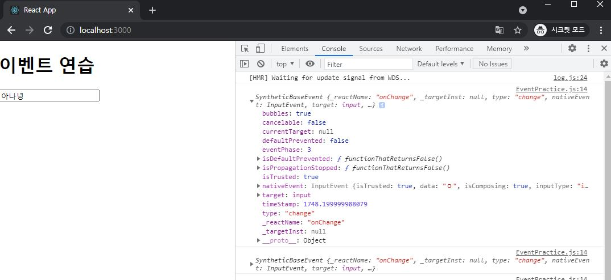
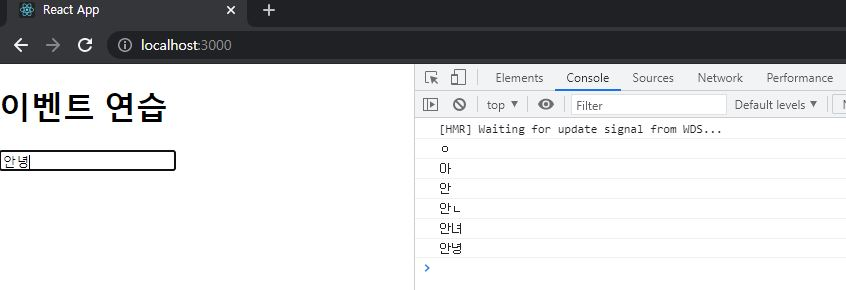
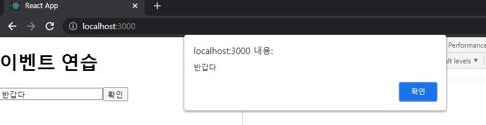
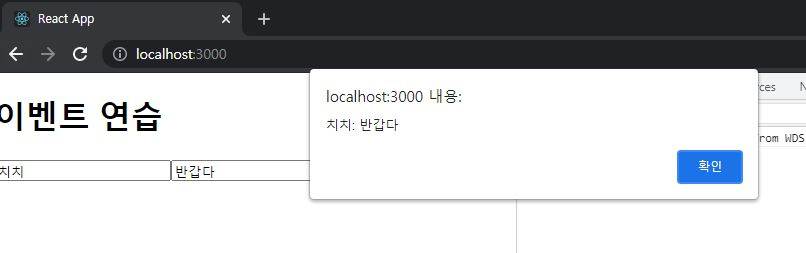
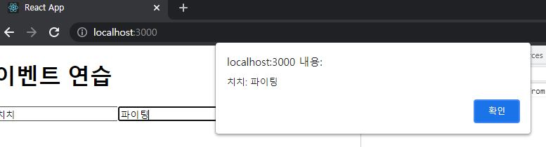

# ReactJS-04

> 이벤트 : 사용자가 웹 브라우저에서 DOM 요소들과 상호작용 하는 것


## 1. 리액트 이벤트 시스템

- 일반적인 DOM요소에 이벤트를 설정하는 방법

```html
<!-- HTML에서 DOM요소에 이벤트를 설정하는 방법 -->
<!DOCTYPE html>
<html>
<head>
  <meta charset="utf-8">
  <meta name="viewport" content="width=device-width">
  <title>JS Bin</title>
</head>
<body>
  <button onclick="alert('executed')">
    Click Me
  </button>
</body>
</html>
```


- 리액트의 이벤트 시스템

```react
import React, { useState } from 'react';

const Say = () => {
    const [message, setMessage] = useState('');
    const onClickEnter = () => setMessage('안녕하세요!');
    const onClickLeave = () => setMessage('안녕히 가세요!');

    return (
        <div>
            <button onClick={onClickEnter}>입장</button>
            <button onClick={onClickLeave}>퇴장</button>
        </div>
    );
};

export default Say;
```


- 이벤트 사용할 때 주의 사항

  1. 이벤트 이름은 카멜 표기법

     - `onclick` → `onClick`

  2. 이벤트에 실행할 자바스크립트 코드를 전달하는 것이 아니라, **함수 형태의 값을 전달**

  3. **DOM 요소에만 이벤트 설정 가능**

     - 우리가 직접 만든 컴포넌트에는 이벤트 설정 불가능

     - MyComponent에 onClick 값을 설정한다면 MyComponent를 클릭할 때 doSomething 함수를 실행하는 것이 아니라, 그냥 이름이 onClick인 props를 전달

       ```react
       <MyComponent onClick={doSomething} />
       ```

- 리액트에서 지원하는 이벤트 종류
  - `Clipboard`, `touch`, `Composition`, `UI`, `Keyboard`, `Wheel`, ...
  - [리액트 메뉴얼(https://reactjs.org/docs/events.html)](https://reactjs.org/docs/events.html)


## 2. `onChange` 이벤트 핸들링

### 2-1) `onChange` 이벤트 설정

```react
// src/EventPractice.js
import React, { Component } from 'react';

class EventPractice extends Component {
    render() {
        return (
            <div>
                <h1>이벤트 연습</h1>
                <input 
                    type="text"
                    name="message"
                    placeholder="아무거나 입력해 보세요"
                    onChange={
                        (e) => {
                            console.log(e);
                        }
                    }
                />
            </div>
        );
    }
}

export default EventPractice;<h1>이벤트 연습</h1>
```



- 콘솔에 입력되는 `e` 객체는 **SyntheticEvent**
  - <u>웹 브라우저의 네이티브 이벤트를 감싸는 객체</u>
  - SyntheticEvent는 네이티브 이벤트와 달리 **이벤트가 끝나고 나면 이벤트가 초기화**되므로 정보를 참조할 수 없다.
  - 비동기적으로 이벤트 객체를 참조할 일이 있다면 `e.persist()` 를 호출

```react
onChange={
	(e) => {
		console.log(e.target.value);
	}
}
```




### 2-2) state에 input값 넣기

```react
// src/EventPractice.js
import React, { Component } from 'react';

class EventPractice extends Component {
    state = {
        message: ''
    }

    render() {
        return (
            <div>
                <h1>이벤트 연습</h1>
                <input 
                    type="text"
                    name="message"
                    placeholder="아무거나 입력해 보세요"
                    value={this.state.message}
                    onChange={
                        (e) => {
                            this.setState({
                                message: e.target.value
                            })
                        }
                    }
                />
                <button onClick={
                    () => {
                        alert(this.state.message);
                        this.setState({
                            message:''
                        });
                    }
                }>확인</button>
            </div>
        );
    }
}

export default EventPractice;<h1>이벤트 연습</h1>
```




### 2-3) 임의 메서드 만들기

```react
// src/EventPractice.js
import React, { Component } from 'react';

class EventPractice extends Component {
    state = {
        message: ''
    }

    constructor(props) {
        super(props);
        this.handleChange = this.handleChange.bind(this);
        this.handleClick = this.handleClick.bind(this);
    }

    handleChange(e) {
        this.setState({
            message: e.target.value
        });
    }

    handleClick(e) {
        alert(this.state.message);
        this.setState({
            message: ''
        });
    }

    render() {
        return (
            <div>
                <h1>이벤트 연습</h1>
                <input 
                    type="text"
                    name="message"
                    placeholder="아무거나 입력해 보세요"
                    value={this.state.message}
                    onChange={this.handleChange}
                />
                <button onClick={this.handleClick}>확인</button>
            </div>
        );
    }
}

export default EventPractice;<h1>이벤트 연습</h1>
```

- 함수가 호출될 때 `this` 는 **호출부에 따라 결정**되므로, <u>클래스의 임의 메서드가 특정 HTML 요소의 이벤트로 등록되는 과정에서 메서드와 this의 관계가 끊어진다.</u>
- 이 때문에 임의 메서드가 이벤트로 등록되어도 `this`를 컴포넌트 자신으로 제대로 가르키기 위해서 메서드를 <u>`this`와 **바인딩(binding)**하는 작업</u>이 필요하다.


### 2-4) Property Initializer Syntax를 사용한 메서드 작성

```react
// src/EventPractice.js
import React, { Component } from 'react';

class EventPractice extends Component {
    state = {
        message: ''
    }

    handleChange = (e) => {
        this.setState({
            message: e.target.value
        });
    }

    handleClick = (e) => {
        alert(this.state.message);
        this.setState({
            message: ''
        });
    }

    render() {
        return (
            <div>
                <h1>이벤트 연습</h1>
                <input 
                    type="text"
                    name="message"
                    placeholder="아무거나 입력해 보세요"
                    value={this.state.message}
                    onChange={this.handleChange}
                />
                <button onClick={this.handleClick}>확인</button>
            </div>
        );
    }
}

export default EventPractice;<h1>이벤트 연습</h1>
```

- 메서드 바인딩이 생성자 메서드에서 하는 것이 정석이지만 새 메서드를 만들때마다 constructor도 수정해야 되기 때문에 불편하다
- 바벨의 transform-class-properties 문법을 사용하여 화살표 함수 형태로 메서드를 정의


### 2-5) input 여러개 다루기

```react
// src/EventPractice.js
import React, { Component } from 'react';

class EventPractice extends Component {
    state = {
        username: '',
        message: ''
    }

    handleChange = (e) => {
        this.setState({
            [e.target.name]: e.target.value
        });
    }

    handleClick = (e) => {
        alert(this.state.username + ': '+ this.state.message);
        this.setState({
            message: ''
        });
    }

    render() {
        return (
            <div>
                <h1>이벤트 연습</h1>
                <input 
                    type="text"
                    name="username"
                    placeholder="사용자명"
                    value={this.state.username}
                    onChange={this.handleChange}
                />
                <input 
                    type="text"
                    name="message"
                    placeholder="아무거나 입력해 보세요"
                    value={this.state.message}
                    onChange={this.handleChange}
                />
                <button onClick={this.handleClick}>확인</button>
            </div>
        );
    }
}

export default EventPractice;<h1>이벤트 연습</h1>
```



- `event` 객체를 활용한다.
- `onChange` 이벤트 핸들러에서 `e.target.name` 은 <u>해당 인풋의 name</u>을 가리킨다.

- 객체 안에서 key를 [ ] 감싸면 그 안에 넣은 레퍼런스가 가리키는 실제 값이 key 값으로 사용된다.

- ```react
  const name = 'variantKey';
  const object = {
      [name]: 'value'
  };
  
  // 결과
  {
      'variantKey': 'value'
  }
  ```

  

### 2-6) onKeyPress 이벤트 핸들링 

```react
import React, { Component } from 'react';

class EventPractice extends Component {
    state = {
        username: '',
        message: ''
    }

    handleChange = (e) => {
        this.setState({
            [e.target.name]: e.target.value
        });
    }

    handleClick = (e) => {
        alert(this.state.username + ': '+ this.state.message);
        this.setState({
            message: ''
        });
    }

    handleKeyPress = (e) => {
        if(e.key === 'Enter') {
            this.handleClick();
        }
    }

    render() {
        return (
            <div>
                <h1>이벤트 연습</h1>
                <input 
                    type="text"
                    name="username"
                    placeholder="사용자명"
                    value={this.state.username}
                    onChange={this.handleChange}
                />
                <input 
                    type="text"
                    name="message"
                    placeholder="아무거나 입력해 보세요"
                    value={this.state.message}
                    onChange={this.handleChange}
                    onKeyPress={this.handleKeyPress}
                />
                <button onClick={this.handleClick}>확인</button>
            </div>
        );
    }
}

export default EventPractice;<h1>이벤트 연습</h1>
```




## 3. 함수형 컴포넌트로 구현

```react
import React, { useState } from 'react';

const EventPractice = () => {
    const [username, setUsername] = useState('');
    const [message, setMessage] = useState('');
    const onChangeUsername = e => setUsername(e.target.value);
    const onChangeMessage = e => setMessage(e.target.value);
    const onClick = () => {
        alert(username + ': ' + message);
        setUsername('');
        setMessage('');
    };
    const onKeyPress = e => {
        if (e.key === 'Enter') {
            onClick();
        }
    };

    return (
        <div>
            <h1>이벤트 연습</h1>
                <input 
                    type="text"
                    name="username"
                    placeholder="사용자명"
                    value={username}
                    onChange={onChangeUsername}
                />
                <input 
                    type="text"
                    name="message"
                    placeholder="아무거나 입력해 보세요"
                    value={message}
                    onChange={onChangeMessage}
                    onKeyPress={onKeyPress}
                />
                <button onClick={this.handleClick}>확인</button>
        </div>
    );
};

export default EventPractice;
```

- 아래 코드는 문자열이 아닌 객체를 넣어보기

```react
import React, { useState } from 'react';

const EventPractice = () => {
    const [form, setForm] = useState({
        username: '',
        message: ''
    });
    const {username, message} = form;
    const onChange = e => {
        const nextForm = {
            ...form,    // 기존의 form 내용을 이 자리에 복사한 뒤
            [e.target.name]: e.target.value // 원하는 값을 덮어 씌우기
        };
        setForm(nextForm);
    };

    const onClick = () => {
        alert(username + ': ' + message);
        setForm({
            username: '',
            message: ''
        });
    };

    const onKeyPress = e => {
        if (e.key === 'Enter') {
            onClick();
        }
    };

    return (
        <div>
            <h1>이벤트 연습</h1>
                <input 
                    type="text"
                    name="username"
                    placeholder="사용자명"
                    value={username}
                    onChange={onChange}
                />
                <input 
                    type="text"
                    name="message"
                    placeholder="아무거나 입력해 보세요"
                    value={message}
                    onChange={onChange}
                    onKeyPress={onKeyPress}
                />
                <button onClick={onClick}>확인</button>
        </div>
    );
};

export default EventPractice;
```

