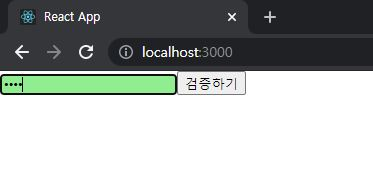
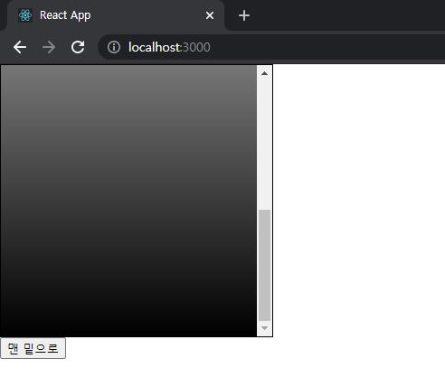

# ReactJS-05 ref

>  ref : HTML에서 id를 사용하여 DOM에 이름을 다는 것처럼 리액트 프로젝트 내부에서 DOM에 이름을 다는 방법


## 1. 상황에 따른 ref 사용

- DOM을 꼭 직접적으로 건드려야 할 때
  - ex) 웹사이트에서 input을 검증할 때
  - 리액트에서는 이런 작업은 굳이 DOM에 직접 접근하지 않아도 `state`로 구현 가능

```css
// src/ValidationSample.css

.success {
  background-color: lightgreen;
}

.failure {
  background-color: lightcoral;
}
```

```react
// src/ValidationSample.js

import React, { Component } from 'react';
import './ValidationSample.css';

class ValidationSample extends Component {
    state = {
        password: '',
        clicked: false,
        validated: false
    }

    handleChange = (e) => {
        this.setState({
            password: e.target.value
        });
    }

    handleButtonClick = () => {
        this.setState({
            clicked: true,
            validated: this.state.password === '0000'
        })
    }

    render() {
        return (
            <div>
                <input
                    type="password"
                    value={this.state.password}
                    onChange={this.handleChange}
                    className={this.state.clicked ? (this.state.validated ? 'success' : 'failure') : ''}
                />
                <button onClick={this.handleButtonClick}>검증하기</button>
            </div>
        );
    }
}

export default ValidationSample;
```


- input 에서 onChange 이벤트가 발생하면 handleChange 를 호출하여 <u>state의 password 값을 업데이트</u>
- button 에서 onClick 이벤트가 발생하면 handleButtonClick을 호출하여 <u>clicked 값을 True 설정</u>하고, <u>validated 값을 검증 결과로 설정</u>
- 위 예제처럼 state만으로 해결할 수 없는 기능이 있다. → 이를 위해 `ref` 사용
  - 특정 input에 포커스 주기
  - 스크롤 박스 조작하기
  - Canvas 요소에 그림 그리기... 등등


## 2. ref 사용

- ref 를 사용하는 2가지 방법

  1. 콜백 함수	

     - ref 를 달고자 하는 요소에 ref 라는 콜백 함수를 props로 전달

     - ref 값을 파라미터로 전달, 함수 내부에서 파라미터로 받은 ref를 컴포넌트의 멤버 변수로 설정

     - ```react
       <input ref={(ref) => {this.input=ref}} />
       ```

  2. createRef

     - ```react
       import React, { Component } from 'react';
       
       class RefSample extends Component {
           input = React.createRef();
       
           handleFocus = () => {
               this.input.current.focus();
           }
       
           render() {
               return (
                   <div>
                       <input ref={this.input} />
                   </div>
               );
           }
       }
       
       export default RefSample;
       ```

     - 컴포넌트 내부에서 멤버 변수로 `React.createRef()` 를 담아준다.

     - 해당 멤버 변수를 ref를 달고자 하는 요소에 ref props로 넣어준다.

     - ref를 설정해 준 DOM에 접근하려면 `this.input.current` 를 조회

---

- 버튼을 눌렀을 때 input 요소에 focus가 되도록 실습

```react
// src/ValidationSample.js

import React, { Component } from 'react';
import './ValidationSample.css';

class ValidationSample extends Component {
    input = React.createRef();

    state = {
        password: '',
        clicked: false,
        validated: false
    }

    handleChange = (e) => {
        this.setState({
            password: e.target.value
        });
    }

    handleButtonClick = () => {
        this.setState({
            clicked: true,
            validated: this.state.password === '0000'
        });
        this.input.focus();
    }

    render() {
        return (
            <div>
                <input
                    type="password"
                    value={this.state.password}
                    onChange={this.handleChange}
                    className={this.state.clicked ? (this.state.validated ? 'success' : 'failure') : ''}
                    ref={(ref) => this.input=ref}
                />
                <button onClick={this.handleButtonClick}>검증하기</button>
            </div>
        );
    }
}

export default ValidationSample;
```



## 3. 컴포넌트에 ref 달기

- 컴포넌트 내부에 있는 DOM을 컴포넌트 외부에서 사용할때 사용

- ```react
  <MyComponent
  	ref={(ref) => {this.myComponent=ref}}    
  />
  ```

- 이렇게 하면 MyComponent 내부의 메소드 및 멤버 변수에도 접근 가능하다.

---

- 스크롤 박스 컴포넌트를 만들고, <u>스크롤바를 아래로 내리는 작업을 부모 컴포넌트</u>에서 실행하는 실습
- scrollTop : 세로 스크롤바 위치(0~350)
- scrollHeight : 스크롤이 있는 박스 안의 div 높이(650)
- clientHeight : 스크롤이 있는 박스의 높이(300)

```react
// src/ScrollBox.js

import React, { Component } from 'react';

class ScrollBox extends Component {
    scrollToBottom = () => {
        const { scrollHeight, clientHeight } = this.box;
        /*
        위 코드는 비구조화 할당 문법으로 아래와 같은 의미이다.
        const scrollHeight = this.box.scrollHeight;
        const clientHeight = this.box.clientHeight;
         */
        this.box.scrollTop = scrollHeight - clientHeight;	// 맨 아래로 내려간다
    }


    render() {
        const style = {
            border: '1px solid black',
            height: '300px',
            width: '300px',
            overflow: 'auto',
            position: 'relative'
        };

        const innerStyle = {
            width: '100%',
            height: '650px',
            background: 'linear-gradient(white, black)'
        }

        return (
            <div
                style={style}
                ref={(ref) => {this.box=ref}}>
                <div style={innerStyle} />
            </div>
        );
    }
}

export default ScrollBox;
```

```react
// src/App.js

import React, { Component } from 'react';
import ScrollBox from './ScrollBox';

class App extends Component {
  render() {
    return (
      <div>
        <ScrollBox ref={(ref) => this.scrollBox=ref} />
        <button onClick={() => this.scrollBox.scrollToBottom()}>
          맨 밑으로
        </button>
      </div>
    );
  }
}

export default App;
```

