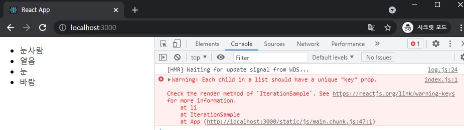
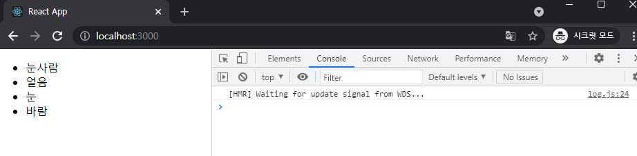
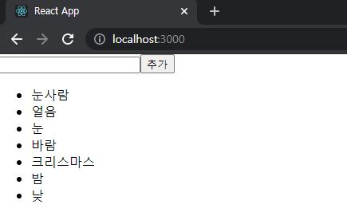
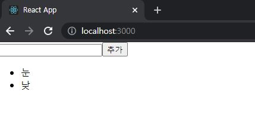

# ReactJS-06 컴포넌트 반복

- 웹 애플리케이션을 만들다 보면 다음과 같이 반복되는 코드를 작성할 때가 있다.

```react
import React from 'react';

const IterationSample = () => {
    return (
    	<ul>
        	<li>눈사람</li>
            <li>얼음</li>
            <li>눈</li>
            <li>바람</li>
        </ul>
    );
};

export default IterationSample;
```

- `<li>...</li>` 코드가 반복된다.


## 1. 자바스크립트 배열의 map() 함수

- 자바스크립트 배열 객체의 내장 함수인 map 함수를 사용하여 반복되는 컴포넌트를 렌더링할 수 있다.
- `arr.map(callback, [thisArg])`
- callback : 새로운 배열의 요소를 생성하는 함수로 파라미터는 다음 세가지
  - curretValue : 현재 처리하고 있는 요소
  - index : 현재 처리하고 있는 요소의 index값
  - array : 현재 처리하고 있는 원본 배열
- thisArg(선택항목) : callback 함수 내부에서 사용할 this 레퍼런스

```javascript
var numbers = [1,2,3,4,5];
var processed = numbers.map(function(num){
    return num*num;
});
console.log(processed);

// output: [1, 4, 9, 16, 25]
/*	ES6 문법
const numbers = [1,2,3,4,5];
const result = numbers.map(num => num * num);
console.log(result);
*/
```


## 2. 데이터 배열을 컴포넌트 배열로 변환

```react
// src/IterationSample.js

import React from 'react';

const IterationSample = () => {
    const names = ['눈사람', '얼음', '눈', '바람'];
    const nameList = names.map(name => <li>{name}</li>)
    return <ul>{nameList}</ul>
};

export default IterationSample;
```

```react
// src/App.js

import React, { Component } from 'react';
import IterationSample from './IterationSample';

class App extends Component {
  render() {
    return (
      <IterationSample />
    );
  }
}

export default App;
```



- 원하는 대로 출력이 되었지만 "key" prop이 없다는 경고메시지가 떴다.


## 3. key

- 리액트에서 key는 컴포넌트 배열을 렌더링했을 때 어떤 원소에 변동이 있었는지 알아내려고 사용

  - ex) 유동적인 데이터를 다룰 때는 원소를 새로 생성, 제거, 수정할 수 있다. 
  - key가 없을 때는 Virtual DOM을 비교하는 과정에서 리스트를 순차적으로 비교하면서 변화를 감지한다.
  - 하지만 key가 있다면 이 값을 사용하여 어떤 변화가 일어났는지 빠르게 알아낼 수 있다.

- key 값을 설정할 때는 map 함수의 인자로 전달되는 함수 내부에서 컴포넌트 props를 설정하듯 설정하면 된다.

  - key값은 언제나 유일해야 한다.

  - ```react
    const articleList = articles.map(article =>(
    	<Article 
        	title={article.title}
            writer={article.writer}
            key={article.id}
        />
    ));
    ```

  - 고유한 값이 없을 때는 map 함수에 전달되는 콜백 함수의 인수인 index 값을 사용

```react
// src/IterationSample.js

import React from 'react';

const IterationSample = () => {
    const names = ['눈사람', '얼음', '눈', '바람'];
    const nameList = names.map((name, index) => <li key={index}>{name}</li>)
    return <ul>{nameList}</ul>
};

export default IterationSample;
```




## 4. 응용

- 데이터 추가 기능

```react
// src/IterationSample.js

import React, { useState } from 'react';

const IterationSample = () => {
    const [names, setNames] = useState([
        {id: 1, text: '눈사람'},
        {id: 2, text: '얼음'},
        {id: 3, text: '눈'},
        {id: 4, text: '바람'},
    ]);

    const [inputText, setInputText] = useState('');
    const [nextId, setNextId] = useState(5);    // 새로운 항목을 추가할 때 사용할 id

    const onChange = e => setInputText(e.target.value);
    const onClick = () => {
        const nextNames = names.concat({
            id: nextId, // nextId 값을 id로 설정하고
            text: inputText
        });
        setNextId(nextId + 1);  // nextId 값에 1을 더해준다.
        setNames(nextNames);    // names 값을 업데이트한다.
        setInputText('');   // inputText를 비운다.
    };

    const namesList = names.map(name => <li key={name.id}>{name.text}</li>);
    return (
        <>
            <input value={inputText} onChange={onChange} />
            <button onClick={onClick}>추가</button>
            <ul>{namesList}</ul>
        </>
    );
};

export default IterationSample;
```




- 데이터 제거 기능

```react
// src/IterationSample.js

import React, { useState } from 'react';

const IterationSample = () => {
    const [names, setNames] = useState([
        {id: 1, text: '눈사람'},
        {id: 2, text: '얼음'},
        {id: 3, text: '눈'},
        {id: 4, text: '바람'},
    ]);

    const [inputText, setInputText] = useState('');
    const [nextId, setNextId] = useState(5);    // 새로운 항목을 추가할 때 사용할 id

    const onChange = e => setInputText(e.target.value);
    const onClick = () => {
        const nextNames = names.concat({
            id: nextId, // nextId 값을 id로 설정하고
            text: inputText
        });
        setNextId(nextId + 1);  // nextId 값에 1을 더해준다.
        setNames(nextNames);    // names 값을 업데이트한다.
        setInputText('');   // inputText를 비운다.
    };
    const onRemove = id => {
        const nextNames = names.filter(name => name.id !== id);
        setNames(nextNames);
    }
    const namesList = names.map(name => 
        <li key={name.id} onDoubleClick={() => onRemove(name.id)}>
            {name.text}
        </li>);
    return (
        <>
            <input value={inputText} onChange={onChange} />
            <button onClick={onClick}>추가</button>
            <ul>{namesList}</ul>
        </>
    );
};

export default IterationSample;
```

