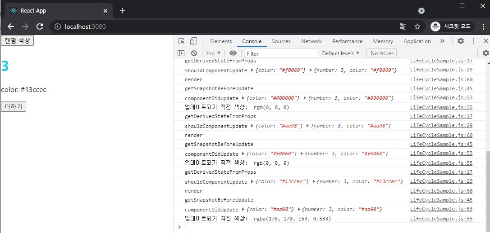
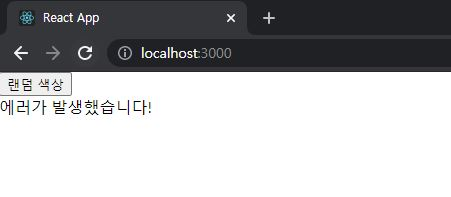

# ReactJS-07 라이프사이클

- 모든 리액트 컴포넌트에는 라이프사이클(수명주기)가 존재
- 컴포넌트의 수명은 페이지에 렌더링되기 전인 준비 과정에서 시작하여 페이지에서 사라질 때 끝난다.
- 라이프사이클 메서드는 클래스형 컴포넌트에서만 사용할 수 있지만 함수형 컴포넌트에서 Hooks 기능을 사용하여 비슷한 작업을 처리할 수 있다.


---


## 1. 라이프 사이클 메서드의 이해

- 라이프사이클 메서드의 종류는 9가지
- **Will** 접두사가 붙은 메서드는 어떤 작업을 작동하기 전에 실행되는 메서드
- **Did** 접두사가 붙은 메서드는 어떤 작업을 작동한 후에 실행되는 메서드
- 라이프사이클은 총 세가지, 즉 **마운트**, **업데이트**, **언마운트** 카테고리로 나뉜다.


## 1-1) 마운트

- DOM이 생성되고 웹 브라우저상에 나타나는 것을 마운트(mount)
- 컴포넌트 만들기 → constructor → getDerivedStateFromProps → render → componentDidMount
  - `constructor` : 컴포넌트를 새로 만들 때마다 호출되는 클래스 생성자 메서드
  - `getDerivedStateFromProps` : props에 있는 값을 state에 넣을 때 사용하는 메서드
  - `render` : 우리가 준비한 UI를 렌더링하는 메서드
  - `componentDidMount` : 컴포넌트가 웹 브라우저상에 나타난 후 호출하는 메서드


## 1-2) 업데이트

- 다음과 같은 네가지 경우에 업데이트 한다.
  1. `props`가 바뀔 때
  2. `state`가 바뀔 때
  3. 부모 컴포넌트가 리렌더링될 때
  4. `this.forceUpdate` 로 강제로 렌더링을 트리거할 때
- `getDerivedStateFromProps` : 마운트 과정에서도 호출되며, 업데이트가 시작하기 전에도 호출된다. props의 변화에 따라 state 값에도 변화를 주고 싶을 때 사용
- `shouldComponentUpdate` : 컴포넌트가 리렌더링을 해야 할지 말아야 할지를 결정하는 메서드. true를 반환하면 다음 라이프 사이클 메서드를 계속 실행하고, false 를 반환하면 작업을 중지
- `render` : 컴포넌트를 리렌더링
- `getSnapshotBeforeUpdate` : 컴포넌트 변화를 DOM에 반영하기 바로 직전에 호출하는 메서드
- `componentDidUpdate` : 컴포넌트의 업데이트 작업이 끝난 후 호출하는 메서드


## 1-3) 언마운트

- 마운트의 반대 과정, 컴포넌트를 DOM에서 제거하는 것을 언마운트(unmount)
- `componentWillUnmount` : 컴포넌트가 웹 브라우저상에서 사라지기 전에 호출하는 메서드


---


## 2. 라이프 사이클 메서드 살펴보기

## 2-1) render() 함수

- ```react
  render() {...}
  ```

- 컴포넌트 모양새를 정의

- 라이프사이클 메서드 중 유일한 필수 메서드

- 이 메서드 안에서 this.props와 this.state에 접근할 수 있으며, 리액트 요소를 반환

- 이 메서드 안에서는 이벤트 설정이 아닌 곳에서 setState를 사용하며 안되고, 브라우저의 DOM에 접근해서도 안된다.


## 2-2) constructor 메서드

- ```react
  constructor(props) {...}
  ```

- 컴포넌트의 생성자 메서드로 컴포넌트를 만들 때 처음으로 실행된다.

- 초기 state를 정할 수 있다.


## 2-3) getDerivedStateFromProps 메서드

```react
static getDerivedStateFromProps(nextProps, prevState) {
    if(nextProps.value !== prevState.value) {	// 조건에 따라 특정 값 동기화
        return { value: nextProps.value };
    }
    return null; // state를 변경할 필요가 없다면 null을 반환
}
```

- 리액트 v16.3 이후에 새로 만든 라이프사이클 메서드
- props로 받아온 값을 state에 동기화시키는 용도로 사용
- 컴포넌트가 마운트될 때와 업데이트될 때 호출된다.


## 2-4) componentDidMount 메서드

```react
componentDidMount() {...}
```

- 컴포넌트를 만들고, 첫 렌더링을 다 마친 후 실행한다.
- 이 안에서 다른 자바스크립트 라이브러리 또는 프레임워크의 함수를 호출하거나 이벤트 등록, setTimeout, setInterval, 네트워크 요청 같은 비동기 작업을 처리하면 된다.


## 2-5) shouldComponentUpdate 메서드

```react
shouldComponentUpdate(nextProps, nextState) {...}
```

- props 또는 state를 변경했을 때, 리렌더링을 시작할지 여부를 지정하는 메서드
- 반드시 true 또는 false 를 반환해야 한다.
- 컴포넌트를 만들 때 이 메서드를 따로 생성하지 않으면 기본적으로 true 값을 반환


## 2-6) getSnapshotBeforeUpdate 메서드

```react
getSnapshotBeforeUpdate(prevProps, prevState) {
    if(prevState.array !== this.state.array) {
        const { scrollTop, scrollHeight } = this.list
        return { scrollTop, scrollHeight };
    }
}
```

- 리액트 v16.3 이후에 만든 메서드
- render 에서 만들어진 결과물이 브라우저에 실제로 반영되기 직전에 호출
- 메서드에서 반환하는 값은 componentDidUpdate에서 세번째 파라미터인 snapshot 값으로 전달 받을 수 있다.
- 주로 업데이트하기 직전의 값을 참고할 일이 있을 때 활용(ex. 스크롤바 위치 유지)


## 2-7) componentDidUpdate 메서드

```react
componentDidUpdate(prevProps, prevState, snapshot) {...}
```

- 렌더링을 완료한 후 실행
- 업데이트가 끝난 직후이므로, DOM 관련 처리를 해도 무방
- prevProps 또는 prevState를 사용하여 컴포넌트가 이전에 가졌던 데이터를 접근할 수 있다.
- getSnapshotBeforeUpdate 에서 반환한 값이 있다면 여기서 snapshot 값을 전달받을 수 있다.


## 2-8) componentWillUnmount 메서드

```react
componentWillUnmount() {...}
```

- 컴포넌트를 DOM에서 제거할 때 실행
- componentDidMount 에서 등록한 이벤트, 타이머, 직접 생성한 DOM이 있다면 여기서 제거 작업을 해야 한다.


## 2-9) componentDidCatch 메서드

```react
componentDidCatch(error, info) {
    this.setState({
        error: true
    });
    console.log({error,info});
}
```

- 리액트 v16.3 이후에 만든 메서드
- 컴포넌틑 렌더링 도중에 에러가 발생했을 때 애플리케이션이 먹통이 되지 않고 오류 UI를 보여 줄 수 있게 해준다.
- error 는 파라미터에 어떤 에러가 발생했는지 알려 준다.
- info 는 어디에 있는 코드에서 오류가 발생했는지에 대한 정보를 준다.
- 실제로 사용할 때 오류가 발생하면 서버 API를 호출하여 따로 수집할 수 있다.
- 컴포넌트 자신에게 발생하는 에러를 잡아낼 수 없고, 자신의 this.props.children으로 전달되는 컴포넌트에서 발생하는 에러만 잡아낼 수 있다.


---


## 3. 라이프사이클 메서드 실습

```react
// src/LifeCycleSample.js

import React, { Component } from 'react';

class LifeCycleSample extends Component {
    state = {
        number: 0,
        color: null,
    }

    myRef = null; // ref를 설정할 부분

    constructor(props) {
        super(props);
        console.log('constructor');
    }

    static getDerivedStateFromProps(nextProps, prevState) {
        console.log('getDerivedStateFromProps');
        if (nextProps.color !== prevState.color) {
            return { color: nextProps.color };
        }
        return null;
    }

    componentDidMount() {
        console.log('componentDidMount');
    }

    shouldComponentUpdate(nextProps, nextState) {
        console.log('shouldComponentUpdate', nextProps, nextState);
        // 숫자의 마지막 자리가 4면 리렌더링하지 않는다.
        return nextState.number % 10 !== 4;
    }

    componentWillUnmount() {
        console.log('componentWillUnmount');
    }

    handleClick = () => {
        this.setState({
            number: this.state.number + 1
        });
    }

    getSnapshotBeforeUpdate(prevProps, prevState) {
        console.log('getSnapshotBeforeUpdate');
        if (prevProps.color !== this.props.color) {
            return this.myRef.style.color;
        }
        return null;
    }

    componentDidUpdate(prevProps, prevState, snapshot) {
        console.log('componentDidUpdate', prevProps, prevState);
        if (snapshot) {
            console.log('업데이트되기 직전 색상: ', snapshot);
        }
    }

    render() {
        console.log('render');

        const style = {
            color: this.props.color
        };

        return (
            <div>
                <h1 style={style} ref={ref => this.myRef = ref}>
                    {this.state.number}
                </h1>
                <p>color: {this.state.color}</p>
                <button onClick={this.handleClick}>
                    더하기
                </button>
            </div>
        );
    }
}

export default LifeCycleSample;
```

```react
// src/App.js

import React, { Component } from 'react';
import LifeCycleSample from './LifeCycleSample';

// 랜덤 색상을 생성
function getRandomColor() {
  return '#' + Math.floor(Math.random() * 1677215).toString(16);
}

class App extends Component {
  state = {
    color: '#000000'
  }

  handleClick = () => {
    this.setState({
      color: getRandomColor()
    });
  }

  render() {
    return (
      <div>
        <button onClick={this.handleClick}>랜덤 색상</button>
        <LifeCycleSample color={this.state.color} />
      </div>
    );
  }
}

export default App;
```




---


## 4. 에러 메서드 실습

```react
// src/LifeCycleSample.js

import React, { Component } from 'react';

class LifeCycleSample extends Component {
    render() {
        return (
            <div>
                {this.props.missing.value}	// 존재하지 않는 객체의 값 조회 => 에러 발생
                <h1 style={style} ref={ref => this.myRef = ref}>
                    {this.state.number}
                </h1>
            </div>
        );
    }
}

export default LifeCycleSample;
```

```react
// src/ErrorBoundary.js

import React, { Component } from 'react';

class ErrorBoundary extends Component {
    state = {
        error: false
    };
    componentDidCatch(error, info) {
        this.setState({
            error: true
        });
        console.log({ error, info });
    }

    render() {
        if (this.state.error) return <div>에러가 발생했습니다!</div>
        return this.props.children;
    }
}

export default ErrorBoundary;
```

```react
// src/App.js

import React, { Component } from 'react';
import LifeCycleSample from './LifeCycleSample';
import ErrorBoundary from './ErrorBoundary';

// 랜덤 색상을 생성
function getRandomColor() {
  return '#' + Math.floor(Math.random() * 1677215).toString(16);
}

class App extends Component {
  state = {
    color: '#000000'
  }

  handleClick = () => {
    this.setState({
      color: getRandomColor()
    });
  }

  render() {
    return (
      <div>
        <button onClick={this.handleClick}>랜덤 색상</button>
        <ErrorBoundary>
          <LifeCycleSample color={this.state.color} />
        </ErrorBoundary>
      </div>
    );
  }
}

export default App;
```

