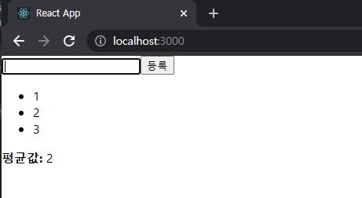

# ReactJS-08 Hooks

> 리액트 v16.8에 새로 도입된 기능, 기존의 함수형 컴포넌트에서 할 수 없었던 다양한 작업을 할 수 있게 해준다.


## 1. useState

- 가장 기본적인 Hook, 함수형 컴포넌트에서도 가변적인 상태를 지닐 수 있게 해준다.
- `useState` 함수의 파라미터에는 상태의 기본값을 넣어준다.
- 함수가 호출되면 배열을 반환하는데 배열의 <u>첫 번째 원소는 **상태 값**</u>, <u>두 번째 원소는 **상태를 설정하는 함수**</u>이다.

```react
// src/Counter.js
import React, { useState } from 'react';

const Counter = () => {
    const [value, setValue] = useState(0);
    
    return (
        <div>
            <p>
                현재 카운터 값은 <b>{value}</b>입니다.
            </p>
            <button onClick={() => setValue(value + 1)}>+1</button>
            <button onClick={() => setValue(value - 1)}>-1</button>
        </div>
    );
};

export default Counter;
```

```react
// src/App.js
import React from 'react';
import Counter from './Counter.js';

const App = () => {
  return <Counter />;
};

export default App;
```


---

### 1-1) useState 여러번 사용하기

- 컴포넌트에서 관리해야 할 상태가 여러개라면 useState를 여러번 사용하면 된다.

```react
// src/Info.js
import React, { useState } from 'react';

const Info = () => {
    const [name, setName] = useState('');
    const [nickname, setNickname] = useState('');

    const onChangeName = e => {
        setName(e.target.value);
    };

    const onChangeNickname = e => {
        setNickname(e.target.value);
    };
    
    return (
        <div>
            <div>
                <input value={name} onChange={onChangeName} />
                <input value={nickname} onChange={onChangeNickname} />
            </div>
            <div>
                <div>
                    <b>이름:</b> {name}
                </div>
                <div>
                    <b>닉네임:</b> {nickname}
                </div>
            </div>
        </div>       
    );
};

export default Info;
```

```react
// src/App.js
import React from 'react';
import Info from './Info';

const App = () => {
  return <Info />;
};

export default App;
```


---


## 2. useEffect

- 리액트 컴포넌트가 렌더링될 때마다 특정 작업을 수행하도록 설정하는 Hooks이다
- 클래스형 컴포넌트의 `componentDidMount` 와 `componentDidUpdate` 를 합친 형태로 봐도 무방

```react
// src/Info.js
import React, { useEffect, useState } from 'react';

const Info = () => {
    ...
    useEffect(() => {
        console.log('렌더링이 완료되었습니다.');
        console.log({
            name,
            nickname
        })
    });
    ...
    
    return (
		...
    );
};

export default Info;
```


---

### 2-1) 마운트 될때만 실행하고 싶을 때

- 컴포넌트가 화면에 맨 처음 렌더링될 때만 실행하고, 업데이트될 때는 실행하지 않으려면 함수의 두 번째 파라미터로 비어 있는 배열을 넣어주면 된다.

```react
// src/Info.js
import React, { useEffect, useState } from 'react';

const Info = () => {
	...
    useEffect(() => {
        console.log('마운트 될 때만 실행됩니다.');    
    }, []);
	...
    
    return (
		...
    );
};

export default Info;
```


---

### 2-2) 특정 값이 업데이트될 때만 실행하고 싶을 때

- 클래스형 컴포넌트일 때

```react
componentDidUpdate(prevProps, prevState) {
    if(prevProps.value !== this.props.value) {
        doSomething();
    }
}
```


- 함수형 컴포넌트에서는 `useEffect` 의 두번째 파라미터로 전달되는 **배열 안에 검사하고 싶은 값**을 넣어주면 된다.

```react
// src/Info.js
import React, { useEffect, useState } from 'react';

const Info = () => {
	...
    useEffect(() => {
        console.log(name);    
    }, [name]);
	...
    
    return (
		...
    );
};

export default Info;
```


---

### 2-3) 뒷정리하기

- `useEffect` 는 기본적으로 렌더링되고 난 직후마다 실행되며, 두 번째 파라미터 배열에 무엇을 넣는지에 따라 실행되는 조건이 달라진다.
- <u>컴포넌트가 언마운트되기 전이나 업데이트되기 직전에 어떠한 작업을 수행</u>하고 싶다면 `useEffect에서 뒷정리(cleanup) 함수`를 반환해야 한다.

```react
// src/Info.js
import React, { useEffect, useState } from 'react';

const Info = () => {
	...
    useEffect(() => {
        console.log('effect');
        console.log(name);
        return () => {
            console.log('cleanup');
            console.log(name);
        };
    }, [name]);
	...
    
    return (
		...
    );
};

export default Info;
```

```react
// src/App.js
import React, { useState } from 'react';
import Info from './Info';

const App = () => {
  const [visible, setVisible] = useState(false);
  return (
    <div>
      <button
        onClick={() => {
          setVisible(!visible);
        }}
      >
        {visible ? '숨기기' : '보이기'}
      </button>
      <hr />
      {visible && <Info />}
    </div>
  );
};

export default App;
```


- 오직 언마운트될 때만 뒷정리 함수를 호출하고 싶다면 useEffect 함수의 두 번째 파라미터에 비어 있는 배열을 넣으면 된다.

```react
useEffect(() => {
    console.log('effect');
    return () => {
        console.log('unmount');
    };
}, []);
```

---

## 3. useReducer

- useState 보다 더 다양한 컴포넌트 상황에 따라 다양한 상태를 다른 값으로 업데이트 해주고 싶을 때 사용하는 Hook이다.
- 리듀서는 현재 상태, 그리고 업데이트를 위해 필요한 정보를 담은 액션(action) 값을 전달받아 새로운 상태를 반환하는 함수이다.
- 리듀서 함수에서 새로운 상태를 만들 때는 반드시 불변성을 지켜줘야 한다.

```react
function reducer(state, action) {
    return { ... };	// 불변성을 지키면서 업데이트한 새로운 상태를 반환
}
```

- 액션 값은 주로 다음과 같은 형태

```react
{
    type: 'INCREMENT',
    // 다른 값들이 필요하다면 추가로 들어감
}
```

- 리덕스에서 사용하는 액션 객체에는 어떤 액션인지 알려주는 type 필드가 꼭 있어야 하지만, useReducer 에서 사용하는 액션 객체는 반드시 type을 지니고 있을 필요가 없다. 객체가 아니라 문자열이나 숫자여도 상관 없다.

---

### 3-1) 카운터 구현하기

- `useReducer`의 첫 번째 파라미터에는 리듀서 함수를 넣고, 두 번째 파라미터에는 해당 리듀서의 기본값을 넣어준다.
- 이 Hook을 사용하면 `state` 값과 `dispatch` 함수를 받아 온다.
- `state`는 현재 가리키고 있는 상태이고, `dispatch`는 액션을 발생시키는 함수이다.
- `dispatch(action)` 과 같은 형태로, 함수 안에 파라미터로 액션 값을 넣어주면 리듀서 함수가 호출되는 구조이다.

```react
// src/Counter.js
import React, { useReducer } from 'react';

function reducer(state, action) {
    // action.type에 따라 다른 작업 수행
    switch (action.type) {
        case 'INCREMENT':
            return { value: state.value + 1 };
        case 'DECREMENT':
            return { value: state.value - 1 };
        default:
            // 아무것도 해당되지 않을 때 기존 상태 변환
            return state;
    }
}

const Counter = () => {
    const [state, dispatch] = useReducer(reducer, { value: 0 });
    
    return (
        <div>
            <p>
                현재 카운터 값은 <b>{state.value}</b>입니다.
            </p>
            <button onClick={() => dispatch({ type: 'INCREMENT' })}>+1</button>
            <button onClick={() => dispatch({ type: 'DECREMENT' })}>-1</button>
        </div>
    );
};

export default Counter;
```

```react
// src/App.js
import React from 'react';
import Counter from './Counter';

const App = () => {
  return <Counter />;
};

export default App;
```


---

### 3-2) 인풋 상태 관리하기

- 기존에는 인풋이 여러 개 일때 `useState`를 여러 번 사용하였다.
- 하지만 `useReducer` 를 사용하면 기존에 클래스형 컴포넌트에서 input 태그에 name 값을 할당하고 `e.target.name` 을 참조하여 `setState`를 해준 것과 유사한 방식으로 작업을 처리한다.

```react
// src/Info.js
import React, { useReducer } from 'react';

function reducer(state, action) {
    return {
        ...state,
        [action.name]: action.value
    }
}

const Info = () => {
    const [state, dispatch] = useReducer(reducer, {
        name: '',
        nickname: ''
    });
    const { name, nickname } = state;
    const onChange = e => {
        dispatch(e.target);
    };
    
    return (
        <div>
            <div>
                <input name="name" value={name} onChange={onChange} />
                <input name="nickname" value={nickname} onChange={onChange} />
            </div>
            <div>
                <div>
                    <b>이름:</b> {name}
                </div>
                <div>
                    <b>닉네임:</b> {nickname}
                </div>
            </div>
        </div>
    );
};

export default Info;
```

```react
// src/App.js
import React from 'react';
import Info from './Info';

const App = () => {
  return <Info />;
};

export default App;
```


---

## 4. useMemo

- useMemo를 사용하면 함수형 컴포넌트 내부에서 발생하는 연산을 최적화할 수 있다.

```react
// src/Average.js
import React, { useState } from 'react';

const getAverage = numbers => {
    console.log('평균값 계산 중..');
    if(numbers.length === 0) return 0;
    const sum = numbers.reduce((a,b) => a+b);
    return sum / numbers.length;
};

const Average = () => {
    const [list, setList] = useState([]);
    const [number, setNumber] = useState('');

    const onChange = e => {
        setNumber(e.target.value);
    };
    const onInsert = e => {
        const nextList = list.concat(parseInt(number));
        setList(nextList);
        setNumber('');
    };

    return (
        <div>
            <input value={number} onChange={onChange} />
            <button onClick={onInsert}>등록</button>
            <ul>
                {list.map((value, index) => (
                    <li key={index}>{value}</li>
                ))}
            </ul>
            <div>
                <b>평균값:</b> {getAverage(list)}
            </div>
        </div>
    )
};

export default Average;
```

```react
// src/App.js
import React from 'react';
import Average from './Average';

const App = () => {
  return <Average />;
};

export default App;
```


- 숫자를 등록할 때 뿐만 아니라 <u>인풋 내용이 수정될 때도 getAverage 함수가 호출되는 것</u>을 볼 수 있다.
- 인풋 내용이 바뀔 때는 평균값을 다시 계산할 필요가 없는데, **렌더링할 때마다 계산하는 것은 낭비**이다.
- `useMemo` Hook을 사용하면 최적화 할 수 있다.
- 렌더링하는 과정에서 특정 값이 바뀌었을 때만 연산을 실행하고, 원하는 값이 바뀌지 않았다면 이전에 연산했던 결과를 다시 사용하는 방식이다.

```react
// src/Average.js
import React, { useState, useMemo } from 'react';

const getAverage = numbers => {
    ...
};

const Average = () => {
    ...
    const avg = useMemo(() => getAverage(list), [list]);

    return (
        <div>
            ...
            <div>
                <b>평균값:</b> {avg}
            </div>
        </div>
    )
};

export default Average;
```


---

## 5. useCallback

- useMemo와 비슷한 함수, 주로 렌더링 성능을 최적화해야 하는 상황에서 사용한다.
- 이 Hook을 사용하면 만들어 놨던 함수를 재사용할 수 있다.

```react
// src/Average.js
import React, { useState, useMemo, useCallback } from 'react';

const getAverage = numbers => {
    ...
};

const Average = () => {
    ...
    
    const onChange = useCallback(e => {
        setNumber(e.target.value);
    }, []); // 컴포넌트가 처음 렌더링될 때만 함수 생성
    
    const onInsert = useCallback(e => {
        const nextList = list.concat(parseInt(number));
        setList(nextList);
        setNumber('');
    }, [number, list]); // number 혹은 list가 바뀌었을 때만 함수 생성

    ...

    return (
        <div>
            ...
            <div>
                <b>평균값:</b> {avg}
            </div>
        </div>
    )
};

export default Average;
```

- `useCallback` 의 <u>첫 번째 파라미터에는 **생성하고 싶은 함수**</u>를 넣고, <u>두 번째 파라미터에는 **배열**</u>을 넣으면 된다.
- 배열에는 어떤 값이 바뀌었을 때 함수를 새로 생성해야 하는지 명시해야 한다.
- *onChange* 처럼 **비어 있는 배열을 넣게 되면 컴포넌트가 렌더링될 때 만들었던 함수를 계속해서 재사용**하게 된다.
- *onInsert* 처럼 배열 안에 number와 list를 넣게 되면 **인풋 내용이 바뀌거나 새로운 항목이 추가될 때 새로 만들어진 함수를 사용**하게 된다.

---

## 6. useRef

- 함수형 컴포넌트에서 ref를 쉽게 사용할 수 있도록 한다.

```react
// src/Average.js
import React, { useState, useMemo, useCallback, useRef } from 'react';

const getAverage = numbers => {
    ...
};

const Average = () => {
    ...
    const inputEl = useRef(null);
    ...
    const onInsert = useCallback(e => {
        ...
        inputEl.current.focus();
    }, [number, list]);
    ...

    return (
        <div>
            <input value={number} onChange={onChange} ref={inputEl} />
            ...
        </div>
    )
};

export default Average;
```

- 등록 버튼을 눌렀을 때 포커스가 input 으로 되도록 작동




---

### 6-1) 로컬 변수 사용하기

- 컴포넌트 로컬 변수를 사용해야 할 때도 useRef 를 활용할 수 있다.
- 로컬 변수란 렌더링과 상관없이 바뀔 수 있는 값을 의미한다.

```react
// 클래스형 컴포넌트
import React, { Component } from 'react';

class MyComponent extends Component {
    id = 1
	setId = (n) => {
        this.id = n;
    }
    printId = () => {
		console.log(this.id);
    }
    render() {
        return (
        	<div>
            	MyComponent
            </div>
        );
    }
}

export default MyComponent;
```

```react
// 함수형 컴포넌트
import React, { useRef } from 'react';

const RefSample = () => {
    const id = useRef(1);
    const setId = (n) => {
        id.current = n;
    }
    const printId = () => {
        console.log(id.current);
    }
    return (
    	<div>
        	refsample
        </div>
    );
};

export default RefSample;
```

- 이렇게 ref 안의 값이 바뀌어도 컴포넌트가 렌더링되지 않는다.

---

## 7. 커스텀 Hooks 만들기

- 여러 컴포넌트에서 비슷한 기능을 공유할 경우, 이를 나만의 Hook으로 작성하여 로직을 재사용할 수 있다.

- 기존에 Info 컴포넌트에서 여러 개의 인풋을 관리하기 위해 useReducer 로 작성했던 로직을 useInputs 라는 Hook으로 따로 분리해보자

```react
// src/useInputs.js
import { useReducer } from 'react';

function reducer(state, action) {
    return {
        ...state,
        [action.name]: action.value
    }
}

export default function useInputs(initialForm) {
    const [state, dispatch] = useReducer(reducer, initialForm);
    const onChange = e => {
        dispatch(e.target);
    };
    return [state, onChange];
}
```

```react
// src/Info.js
import React from 'react';
import useInputs from './useInputs';

const Info = () => {
    const [state, onChange] = useInputs({
        name: '',
        nickname: ''
    });
    const { name, nickname } = state;
    
    return (
        <div>
            <div>
                <input name="name" value={name} onChange={onChange} />
                <input name="nickname" value={nickname} onChange={onChange} />
            </div>
            <div>
                <div>
                    <b>이름:</b> {name}
                </div>
                <div>
                    <b>닉네임:</b> {nickname}
                </div>
            </div>
        </div>
    );
};

export default Info;
```

---

## 8. 다른 Hooks

- 커스텀 Hook를 만들어서 사용했던 것처럼 다른 개발자가 만든 Hooks도 라이브러리로 설치하여 사용할 수 있다.
  - https://nikgraf.github.io/react-hooks/
  - https://github.com/rehooks/awesome-react-hooks

