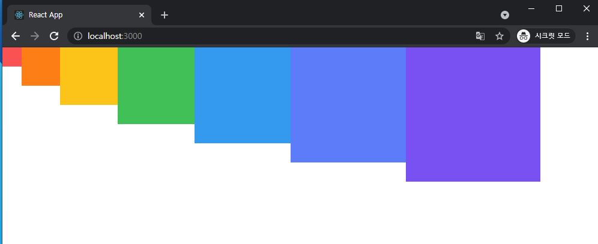
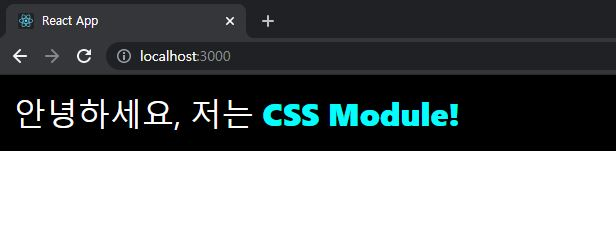
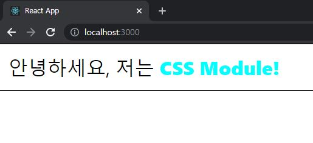
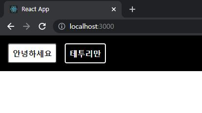

# ReactJS-09 컴포넌트 스타일링

- 다양한 방식의 컴포넌트 스타일링
  - 일반 CSS : 가장 기본적인 방식
  - Sass : 자주 사용되는 CSS 전처리기 중 하나로 확장된 CSS 문법을 사용
  - CSS Module : CSS 클래스가 다른 CSS 클래스의 이름과 절대 충돌하지 않도록 파일마다 고유한 이름을 자동으로 생성해주는 옵션
  - styled-components : 스타일을 자바스크립트 파일에 내장시키는 방식

---

## 1. 일반 CSS

- css를 작성할 때 가장 중요한 점은 CSS 클래스를 중복되지 않게 만드는 것
  - 이름을 지을 때 특별한 규칙을 사용하여 짓는 것
  - CSS Selector를 활용


### 1-1) 이름 짓는 규칙

- 클래스 이름에 컴포넌트 이름을 포함시킴으로써 다른 컴포넌트에서 중복되는 것을 방지(`컴포넌트 이름-클래스`)
  - ex) App.css 안의 `App-header`
- BEM 네이밍
  - 해당 클래스가 어디에서 어떤 용도로 사용되는지 명확하게 작성하는 방식
  - `.card_title-primary`


### 1-2) CSS Selector

- CSS 클래스가 특정 클래스 내부에 있는 경우에만 스타일을 적용할 수 있다.

  - ```react
    .App .logo {
        animation: App-logo-spin infinite 20s linear;
        height: 4-vmin;
    }
    ```

---

## 2. Sass 사용하기

- **S**yntactically **A**wesome **S**tyle **S**heets : 문법적으로 매우 멋진 스타일시트

- CSS 전처리기로 복잡한 작업을 쉽게 할 수 있도록 해준다.

- 스타일 코드의 재활용성을 높여주고, 코드의 가독성을 높여 유지보수를 쉽게 해준다.

- v2 버전부터는 별도의 추가 설정 없이 바로 사용 가능

- 두가지 확장자 `.scss` 와 `.sass` 를 지원

  - ```react
    // .sass
    $font-stack: Helvetica, sans-serif
    $primary-color: #333
    
    body
    	font: 100% $font-stack
    	color: $primary-color
    ```

  - ```react
    // .scss
    $font-stack: Helvetica, sans-serif;
    $primary-color: #333;
    
    body {
        font: 100% $font-stack;
        color: $primary-color;
    }
    ```

- ```bash
  $ yarn add node-sass@4.14.1
  ```

  - **node-sass** 라는 라이브러리를 설치한다.(<u>Sass를 CSS로 변환해주는 라이브러리</u>)
  - 2021년 1월 기준, node-sass의 최신버전이 create-react-app 에서 지원되지 않아 구 버전을 이용!


```react
// src/SassComponent.scss

// 변수 사용
$red: #fa5252;
$orange: #fd7e14;
$yellow: #fcc419;
$green: #40c057;
$blue: #339af0;
$indigo: #5c7cfa;
$violet: #7950f2;

// 믹스인 만들기(재사용되는 스타일 블록을 함수처럼 사용할 수 있다.)
@mixin square($size) {
  $calculated: 32px * $size;
  width: $calculated;
  height: $calculated;
}

.SassComponent {
  display: flex;
  .box {
    // 일반 CSS에서는 .SassComponent .box 와 마찬가지
    background: red;
    cursor: pointer;
    transition: all 0.3s ease-in;
    &.red {
      // .red 클래스가 .box와 함께 사용되었을 때
      background: $red;
      @include square(1);
    }
    &.orange {
      background: $orange;
      @include square(2);
    }
    &.yellow {
      background: $yellow;
      @include square(3);
    }
    &.green {
      background: $green;
      @include square(4);
    }
    &.blue {
      background: $blue;
      @include square(5);
    }
    &.indigo {
      background: $indigo;
      @include square(6);
    }
    &.violet {
      background: $violet;
      @include square(7);
    }
    &:hober {
      // .box에 마우스를 올렸을 때
      background: black;
    }
  }
}
```

```react
// src/SassComponent.js
import React from 'react';
import './SassComponent.scss';

const SassComponent = () => {
    return (
        <div className="SassComponent">
            <div className="box red" />
            <div className="box orange" />
            <div className="box yellow" />
            <div className="box green" />
            <div className="box blue" />
            <div className="box indigo" />
            <div className="box violet" />
        </div>
    );
};

export default SassComponent;
```

```react
// src/App.js
import React, { Component } from 'react';
import SassComponent from './SassComponent';

class App extends Component {
  render() {
    return (
      <div>
        <SassComponent />
      </div>
    );
  }
}

export default App;
```




### 2-1) utils 함수 분리하기

- 여러 파일에서 사용될 수 있는 **Sass 변수** 및 **믹스인**은 <u>다른 파일로 따로 분리하여 사용</u> 가능하다.

```react
// src/styles/utils.scss

// 변수 사용
$red: #fa5252;
$orange: #fd7e14;
$yellow: #fcc419;
$green: #40c057;
$blue: #339af0;
$indigo: #5c7cfa;
$violet: #7950f2;

// 믹스인 만들기(재사용되는 스타일 블록을 함수처럼 사용할 수 있다.)
@mixin square($size) {
  $calculated: 32px * $size;
  width: $calculated;
  height: $calculated;
}
```

```react
// src/SassComponent.scss
@import "./styles/utils.scss";

.SassComponent {
  ...
}
```


### 2-2) sass-loader 설정 커스터마이징

- 프로젝트에 디렉터리를 많이 만들어서 구조가 깊어졌다면 해당 파일에서 상위 폴더로 한참 올라가야 한다는 단점이 발생
- 웹팩에서 Sass 를 처리하는 sass-loader의 설정을 커스터마이징하여 해결
- *webpack.config.js*


### 2-3) node_modules 에서 라이브러리 불러오기

- Sass 의 장점 중 하나인 라이브러리를 쉽게 불러와서 사용 가능한 점
- 깊숙한 디렉터리에 위치할 경우 물결 문자(~) 사용
  - `@import '~library/styles';`

---

## 3. CSS Module

- CSS를 불러와서 사용할 때 클래스 이름을 고유한 값으로 만들어서 컴포넌트 스타일 클래스 이름이 중첩되는 현상을 방지해주는 기술
  - `[파일 이름]_[클래스 이름]_[해시값]`

```react
// src/CSSModule.module.css

/* 자동으로 고유해질 것이므로 흔히 사용되는 단어를 클래스 이름으로 마음대로 사용 가능  */
.wrapper {
  background: black;
  padding: 1rem;
  color: white;
  font-size: 2rem;
}

/* 글로벌 CSS를 작성하고 싶다면 */
:global .something {
  font-weight: 800;
  color: aqua;
}
```

```react
// src/CSSModule.js
import React from 'react';
import styles from './CSSModule.module.css';

const CSSModule = () => {
    return (
        <div className={styles.wrapper}>
            안녕하세요, 저는 <span className="something">CSS Module!</span>
        </div>
    );
};

export default CSSModule;
```

```react
// src/App.js
import React, { Component } from 'react';
import CSSModule from './CSSModule';

class App extends Component {
  render() {
    return (
      <div>
        <CSSModule />
      </div>
    );
  }
}

export default App;
```



- CSS Module이 적용된 스타일 파일을 불러오면 객체를 하나 전달받게 된다.
- CSS Module에서 사용한 클래스 이름과 해당 이름을 **고유화한 값이 키-값 형태**로 들어있다.
  - ex) `{ wrapper: "cSSModule_wrapper_1SbdQ"}`

- 고유한 클래스 이름을 사용하려면 엘리먼트에 `className={styles.[클래스 이름]}` 형태로 전달
- `:global` 을 사용한 전역적으로 선언한 클래스의 경우 평상시 문법처럼 그냥 문자열 작성

---

- 클래스 이름을 두 개 이상 적용 방법

```react
// src/CSSModule.module.css

.wrapper {
  ...
}

.inverted {
  color: black;
  background: white;
  border: 1px solid black;
}
    
:global .something {
  ...
}
```

```react
// src/CSSModule.js
import React from 'react';
import styles from './CSSModule.module.css';

const CSSModule = () => {
    return (
        <div className={`${styles.wrapper} ${styles.inverted}`}>
            안녕하세요, 저는 <span className="something">CSS Module!</span>
        </div>
    );
};

export default CSSModule;
```



- ES6 문법 템플릿 리터럴을 사용하여 문자열을 합해준다.

  - 문자열 안에 자바스크립트 레퍼런스를 쉽게 넣어줄 수 있다.

  - ```javascript
    const name = '리액트';
    // const message = '제 이름은 ' + name + '입니다.'
    const message = `제 이름은 ${name}입니다.`;
    ```

  - 여기서 사용되는 ` 문자는 백틱(backtick)

- 템플릿 리터럴 문법을 사용하고 싶지 않다면 `className={[styles.wrapper, styles.inverted].join(' ')}`

---

### 3-1) classnames

- CSS 클래스를 조건부로 설정할 때 매우 유용한 라이브러리

- ```bash
  $ yarn add classnames
  ```

- ```react
  // classnames 간략 사용법
  import classNames from 'classnames';
  
  classNames('one', 'two');	// = 'one two'
  classNames('one', { two: true });	// = 'one two'
  classNames('one', { two: false });	// = 'one'
  classNames('one', ['two', 'three']);	// = 'one two three'
  
  const myClass = 'hello';
  classNames('one', myClass, { myCondition: true });	// = 'one hello myCondition'
  ```

- ```react
  // Example
  const MyComponent = ({ highlighted, theme }) => (
  	<div className={classNames('MyComponent', { highlighted }, theme)}>Hello</div>
  );
  ```

- 위 엘리먼트의 클래스에 highlighted 값이 true이면 highlighted 클래스가 적용되고, false이면 적용되지 않는다.

- theme 으로 전달받는 문자열은 내용 그대로 클래스에 적용된다.

---

## 4. styled-components

- 자바스크립트 파일 안에 스타일을 선언하는 방식

- CSS-in-JS

- 이와 관련된 라이브러리 중 가장 선호하는 `styled-components` 가 있다.

- ```bash
  $ yarn add styled-components
  ```

- 자바스크립트 파일 하나에 스타일까지 작성할 수 있기 때문에 `.css` 또는 `.scss` 확장자를 가진 스타일 파일을 따로 만들지 않아도 되는 이점이 있다.

```react
// src/StyledComponent.js
import React from 'react';
import styled, { css } from 'styled-components';

const Box = styled.div`
    /* props로 넣어 준 값을 직접 전달해 줄 수 있다. */
    background: ${props => props.color || 'blue'};
    padding: 1rem;
    display: flex;
`;

const Button = styled.button`
    background: white;
    color: black;
    border-radius: 4px;
    padding: 0.5rem;
    display: flex;
    align-items: center;
    justify-content: center;
    box-sizing: border-box;
    font-size: 1rem;
    font-weight: 600;

    /* & 문자를 사용하여 Sass처럼 자기 자신 선택 가능 */
    &:hober {
        background: rgba(255, 255, 255, 0.9);
    }

    /* 다음 코드는 inverted 값이 true일 때 특정 스타일을 부여 */
    ${props =>
        props.inverted &&
        css`
            background: none;
            border: 2px solid white;
            color: white;
            &:hover {
                background: white;
                color: black;
            }
        `};
        & + button {
            margin-left: 1rem;
        }
    }
`;

const StyledComponent = () => (
    <Box color="black">
        <Button>안녕하세요</Button>
        <Button inverted={true}>테투리만</Button>
    </Box>

);

export default StyledComponent;
```

```react
// src/App.js
import React, { Component } from 'react';
import StyledComponent from './StyledComponent';

class App extends Component {
  render() {
    return (
      <div>
        <StyledComponent />
      </div>
    );
  }
}

export default App;
```

