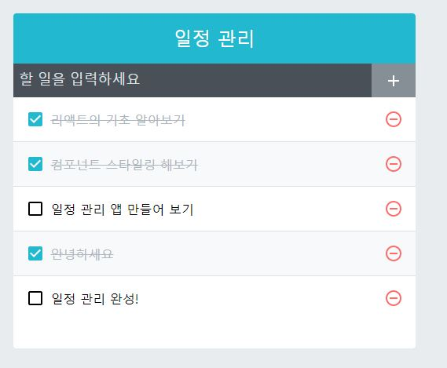

# ReactJS-10 일정 관리 웹 애플리케이션

- 프로젝트 준비

  - ```bash
    $ yarn create react-app todo-app
    ```

  - ```bash
    $ cd todo-app
    $ yarn add node-sass@4.14.1 classnames react-icons
    ```

- Prettier 설정
  - ```json
    {
        "singleQuote": true,
        "semi": true,
        "useTabs": false,
        "tabWidth": false,
        "trailingComma": "all",
        "printWidth": 80
    }
    ```

- 기능별 컴포넌트

  - `TodoTemplate`: 화면을 가운데에 정렬시켜 주며, 앱 타이틀(일정 관리)을 보여준다. children으로 내부 JSX를 props로 받아 와서 렌더링 해준다.
  - `TodoInsert`: 새로운 항목을 입력하고 추가할 수 있는 컴포넌트이다. state를 통해 인풋의 상태를 관리한다.
  - `TodoListItem`: 각 할일 항목에 대한 정보를 보여 주는 컴포넌트이다. todo 객체를 props로 받아와서 상태에 따라 다른 스타일의 UI를 보여준다.
  - `TodoList`: todos 배열을 props로 받아 온 후, 이를 배열 내장 함수 map을 사용해서 여러개의 TodoListItem 컴포넌트로 변환해준다.

- react-icons

  - https://react-icons.github.io/react-icons

- 리액트 개발자 도구
  - 크롭 웹스토어 => React Developer Tools

---

- 코드 양이 많아 깃허브에 따로 올리겠다.

```react
// src/App.js
import React, { useState, useRef, useCallback } from 'react';
import TodoInsert from './components/TodoInsert';
import TodoList from './components/TodoList';
import TodoTemplate from './components/TodoTemplate';

const App = () => {
  const [todos, setTodos] = useState([
    {
      id: 1,
      text: '리액트의 기초 알아보기',
      checked: true,
    },
    {
      id: 2,
      text: '컴포넌트 스타일링 해보기',
      checked: true,
    },
    {
      id: 3,
      text: '일정 관리 앱 만들어 보기',
      checked: false,
    },
  ]);

  // 고유값으로 사용될 id
  // ref를 사용하여 변수 담기
  const nextId = useRef(4);

  const onInsert = useCallback(
    text => {
      const todo = {
        id: nextId.current,
        text,
        checked: false,
      };
      setTodos(todos.concat(todo));
      nextId.current += 1; // nextId 1씩 더하기
    },
    [todos],
  );

  const onRemove = useCallback(
    id => {
      setTodos(todos.filter(todo => todo.id !== id));
    },
    [todos],
  );

  const onToggle = useCallback(
    id => {
      setTodos(
        todos.map(todo =>
          todo.id === id ?  {...todo, checked: !todo.checked } : todo,  
        ),
      );
    },
    [todos],
  );

  return (
    <TodoTemplate>
      <TodoInsert onInsert={onInsert} />
      <TodoList todos={todos} onRemove={onRemove} onToggle={onToggle} />
    </TodoTemplate>
  );
};

export default App;
```

```react
// src/components/TodoTemplate.js
import React from 'react';
import './TodoTemplate.scss';

const TodoTemplate = ({ children }) => {
    return (
        <div className="TodoTemplate">
            <div className="app-title">일정 관리</div>
            <div className="content">{children}</div>
        </div>
    );
};

export default TodoTemplate;
```

```react
// src/components/TodoInsert.js
import React, { useState, useCallback } from 'react';
import { MdAdd } from 'react-icons/md';
import './TodoInsert.scss';

const TodoInsert = ({ onInsert }) => {
    const [value, setValue] = useState('');

    const onChange = useCallback(e => {
        setValue(e.target.value);
    }, []);

    const onSubmit = useCallback(
        e => {
            onInsert(value);
            setValue('');   // value 값 초기화

            // submit 이벤트는 브라우저에서 새로고침을 발생시킨다.
            // 이를 방지하기 위해 이 함수를 호출한다.
            e.preventDefault();
        },
        [onInsert, value],
    );

    return (
        <form className="TodoInsert" onSubmit={onSubmit}>
            <input 
                placeholder="할 일을 입력하세요" 
                value={value}
                onChange={onChange}
                />
            <button type="submit">
                <MdAdd />
            </button>
        </form>
    );
};

export default TodoInsert;
```

```react
// src/components/TodoList.js
import React from 'react';
import TodoListItem from './TodoListItem';
import './TodoList.scss';

const TodoList = ({ todos, onRemove, onToggle }) => {
    return (
        <div className="TodoList">
            {todos.map(todo => (
                <TodoListItem todo={todo} key={todo.id} onRemove={onRemove} onToggle={onToggle} />
            ))}
        </div>
    );
};

export default TodoList;
```

```react
// src/components/TodoListItem.js
import React from 'react';
import {
    MdCheckBoxOutlineBlank,
    MdCheckBox,
    MdRemoveCircleOutline,
} from 'react-icons/md';
import cn from 'classnames';
import './TodoListItem.scss'

const TodoListItem = ({ todo, onRemove, onToggle }) => {
    const { id, text, checked } = todo;

    return (
        <div className="TodoListItem">
            <div className={cn('checkbox', { checked })} onClick={() => onToggle(id)}  >
                {checked ? <MdCheckBox /> : <MdCheckBoxOutlineBlank />}
                <div className="text">{text}</div>
            </div>
            <div className="remove" onClick={() => onRemove(id)}>
                <MdRemoveCircleOutline />
            </div>
        </div>
    );
};

export default TodoListItem;
```


- 

---

- 느낀 점

  - 아직도 부족한 점이 너무 많다. 책에 있는 내용을 최대한 이해하면서 보고 타이핑을 했는데 중간에 어려운 개념(아직 이해가 안된)들이 있어서 완성하고도 찝찝하다.
  - 그리고 생각한 것 보다 컴포넌트들을 상세히 세분화한 거 같다. 그래서 더욱 어렵게 느껴졌다.

- 다시 짚어봐야 할 내용

  - props, children(컴포넌트들끼리 데이터 전달)

  - setState

  - classnames

  - 자바스크립트 람다식 표현

    - ```react
      const TodoList = ({ todos, onRemove, onToggle }) => {
          return (
              <div className="TodoList">
                  {todos.map(todo => (
                      <TodoListItem todo={todo} key={todo.id} onRemove={onRemove} onToggle={onToggle} />
                  ))}
              </div>
          );
      };

  - map() 함수

  - useCallBack() 함수

  - ref

  - 배열 비구조화 할당

    - ```react
      const [value, setValue] = useState('');
      ```

  - 이벤트 처리

  - rcss

  - css 코드에서 `&::`, `&` 키워드 사용

  - 추가적인 css 문법

    - flex, border, outline, padding, transition, overflow, ...