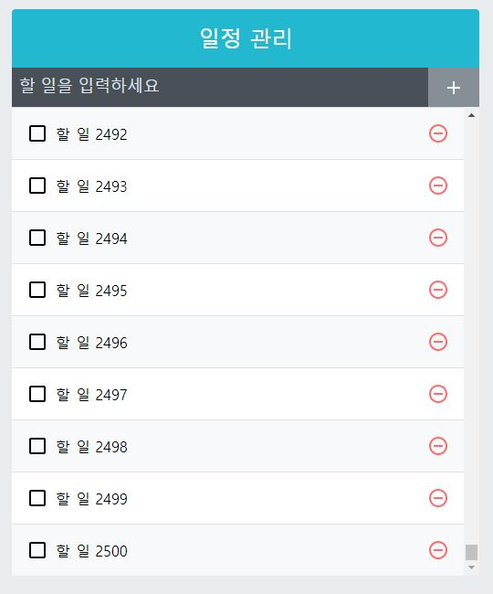
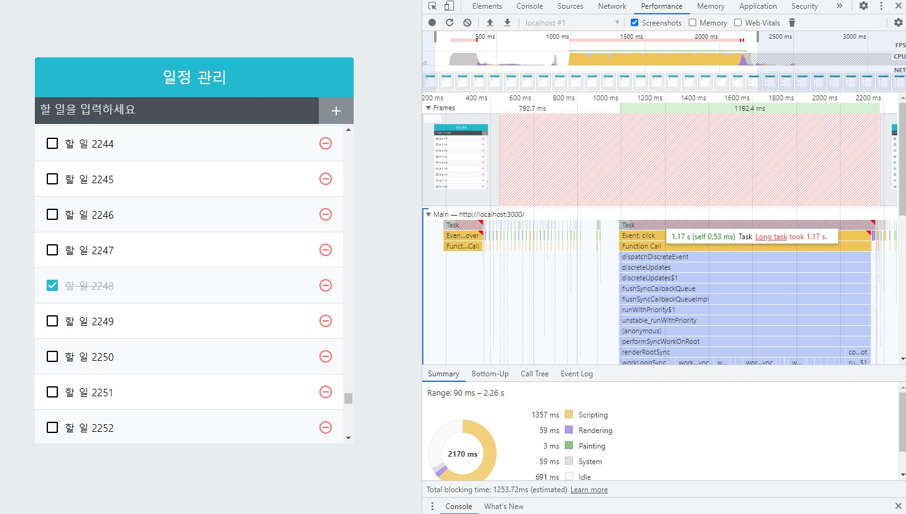
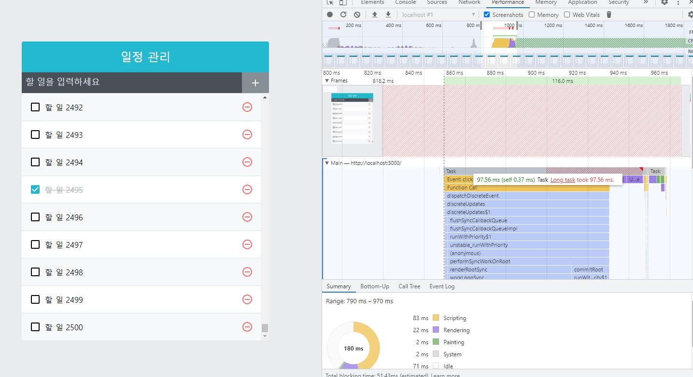

# ReactJS-11 컴포넌트 성능 최적화


## 1. 많은 데이터 렌더링하기

- 앞에서 만든 todo-app 을 이용
- 랙(lag)을 경험할 수 있도록 많은 데이터를 렌더링

```react
// src/App.js
import React, { useState, useRef, useCallback } from 'react';
import TodoInsert from './components/TodoInsert';
import TodoList from './components/TodoList';
import TodoTemplate from './components/TodoTemplate';

function createBulkTodos() {
  const array = [];
  for (let i = 1; i <= 2500; i++) {
    array.push({
      id: i,
      text: `할 일 ${i}`,
      checked: false,
    });
  }
  return array;
}

const App = () => {
  const [todos, setTodos] = useState(createBulkTodos);

  // 고유값으로 사용될 id
  // ref를 사용하여 변수 담기
  const nextId = useRef(2501);

 (...)
};

export default App;
```



- `createBulkTodos` 라는 함수를 만들어서 데이터를 2,500개를 생성
- 주의할 점: `useState`의 기본값에 함수를 넣어 주었다.
  - `useState(createBulkTodos())` 라고 작성하면 리렌더링될 때마다 `createBulkTodos` 함수가 호출
  - `useState(createBulkTodos)`처럼 파라미터를 함수 형태로 넣어주면 컴포넌트가 처음 렌더링될 때만 `createBulkTodos` 함수가 실행된다.

---

## 2. 크롬 개발자 도구를 통한 성능 모니터링

- 크롬 개발자 도구의 Performance 탭 - 녹화 - stop
- 리스트 화면에서 '할 일' 항목을 체크
- 
- 이 한번의 작업을 하는데 1.17초가 걸렸다고 나타났다.
- 성능이 매우 나쁘다!!

---

## 3. 느려지는 원인 분석

- 컴포넌트는 다음과 같은 상황에서 리렌더링이 발생
  1. 자신이 전달받은 `props`가 변경될 때
  2. 자신의 `state`가 바뀔 때
  3. 부모 컴포넌트가 리렌더링될 때
  4. forceUpdate 함수가 실행될 때
- 위 상황은 '할 일' 항목을 체크할 경우 **App 컴포넌트**의 `state`가 변경되면서 **App 컴포넌트**가 리렌더링된다.
- 부모 컴포넌트가 리렌더링 되었으니 TodoList 컴포넌트가 리렌더링되고 그 안의 **무수한 컴포넌트들**도 리렌더링 된다.
- 하나의 '할 일' 항목은 리렌더링 되는 것이 맞지만, 나머지 항목들은 리렌더링 안해도 되는 상황이다.

---

## 4. React.memo 를 사용하여 컴포넌트 성능 최적화

- 컴포넌트 리렌더링을 방지할 때는 `shouldComponentUpdate` 라는 라이프사이클을 사용하면 된다.
- 하지만 함수형 컴포넌트에서는 라이프사이클 메서드를 사용할 수 없다. => `React.memo` 함수를 사용
- 컴포넌트의 props가 바뀌지 않았다면, 리렌더링하지 않도록 설정

```react
// src/components/TodoListItem.js
import React from 'react';
import (...);

const TodoListItem = ({ todo, onRemove, onToggle }) => {
    (...);
};

export default React.memo(TodoListItem);
```

- 이제 **TodoListItem컴포넌트**는 `todo`, `onRemove`, `onToggle` 이 바뀌지 않으면 리렌더링 하지 않는다.

---

## 5. onToggle, onRemove 함수가 바뀌지 않게 하기

- 현재 프로젝트에서 `todos` 배열이 업데이트되면 `onRemove`와 `onToggle` 함수도 새롭게 바뀐다.
- 배열 상태를 업데이트 하는 과정에서 최신 상태의 `todos`를 참조하기 때문에 `todos` 배열이 바뀔 때마다 함수가 새로 만들어진다.
- 이렇게 함수가 계속 만들어지는 상황을 방지하는 방법은 2가지
  1. `useState`의 함수형 업데이트 기능을 사용
  2. `useReducer`

---

### 5-1) useState의 함수형 업데이트

- 기존에 setTodos 함수를 사용할 때는 새로운 상태를 파라미터로 넣어주었다.
- 새로운 상태를 파라미터로 넣는 대신, 상태 업데이트를 <u>어떻게 할지 정의해 주는 업데이트 함수</u>를 넣어준다. => **함수형 업데이트**

```react
const [number, setNumber] = useState(0);
// prevNumbers는 현재 number 값을 가리킨다.
const onIncrease = useCallback(
	() => setNumber(prevNumber => prevNumber + 1),
    [],
);
```

- setNumber(number+1) 을 하는 것이 아니라, 위 코드처럼 어떻게 업데이트할지 정의해 주는 업데이트 함수를 넣어준다.

```react
// src/App.js
import ...

function createBulkTodos() {
  ...
}

const App = () => {
  const [todos, setTodos] = useState(createBulkTodos);
  const nextId = useRef(2501);

  const onInsert = useCallback(
    text => {
      const todo = {
        id: nextId.current,
        text,
        checked: false,
      };
      setTodos(todos => todos.concat(todo));
      nextId.current += 1; // nextId 1씩 더하기
    },[]);

  const onRemove = useCallback(id => {
      setTodos(todos => todos.filter(todo => todo.id !== id));
    }, []);

  const onToggle = useCallback(id => {
      setTodos(todos =>
        todos.map(todo =>
          todo.id === id ?  {...todo, checked: !todo.checked } : todo,  
        ),
      );
    }, []);

  return (
    ...
  );
};

export default App;
```



- `onToggle`, `onRemove`, `onInsert` 함수 수정
- 1.17초에서 0.097초로 성능이 향상된 걸 확인할 수 있다.

---

### 5-2) useReducer 사용하기

```react
import React, { useReducer, useRef, useCallback } from 'react';
import TodoInsert from './components/TodoInsert';
import TodoList from './components/TodoList';
import TodoTemplate from './components/TodoTemplate';

function createBulkTodos() {
  (...)
}

function todoReducer(todos, action) {
  switch (action.type) {
    case 'INSERT':  // 새로 추가
      // { type: 'INSERT', todo: { id:1, text: 'todo', checked: false } }
      return todos.concat(action.todo);
    case 'REMOVE':  // 제거
      // { type: 'REMOVE', id: 1 }
      return todos.filter(todo => todo.id !== action.id);
    case 'TOGGLE':  // 토글
      // { type: 'TOGGLE', id: 1 }
      return todos.map(todo =>
        todo.id === action.id ? { ...todo, checked: !todo.checked } : todo,
        );
    default:
      return todos;
  }
}

const App = () => {
  const [todos, dispatch] = useReducer(todoReducer, undefined, createBulkTodos);
  const nextId = useRef(2501);

  const onInsert = useCallback(text => {
      const todo = {
        id: nextId.current,
        text,
        checked: false,
      };
      dispatch({ type: 'INSERT', todo });
      nextId.current += 1; // nextId 1씩 더하기
    },[]);

  const onRemove = useCallback(id => {
    dispatch({ type: 'REMOVE', id });
    }, []);

  const onToggle = useCallback(id => {
    dispatch({ type: 'TOGGLE', id });
    }, []);

  return (
    ...
  );
};

export default App;
```

- `useReducer` 를 사용할 때는 두 번째 파라미터에 초기 상태를 넣어줘야 한다.
  - 여기서는 두 번째 파라미터에 `undefined`를 넣고, 세 번째 파라미터에 초기 상태를 만들어 주는 함수인 `createBulkTodos` 를 넣어주었다.
  - 이렇게 하면 컴포넌트가 맨 처음 렌더링될 때만 `createBulkTodos` 함수가 호출된다.
- 상태를 업데이트하는 로직을 모아서 컴포넌트 바깥에 둘 수 있다는 장점이 있다.

---

## 6. 불변성의 중요성

- 리액트 컴포넌트에서 상태를 업데이트할 때 불변성을 지키는 것이 매우 중요하다.
- 기존의 값을 직접 수정하지 않으면서 새로운 값을 만들어 내는 것을 **'불변성을 지킨다'**고 표현

```react
const onToggle = useCallback(id => {
    setTodos(todos =>
             todos.map(todo =>
                       todo.id === id ?  {...todo, checked: !todo.checked } : todo,  
                      ),
            );
}, []);
```

- onToggle 함수를 보면 기존 데이터를 수정할 때 직접 수정하지 않고, 새로운 배열을 만든 다음에 새로운 객체를 만들어서 필요한 부분을 교체해 주는 방식으로 구현했다.
- 업데이트가 필요한 곳에서는 새로운 배열, 새로운 객체를 만들기 때문에 `React.memo` 를 사용했을 때 `props`가 <u>바뀌었는지 혹은 바뀌지 않았는지를 알아내서 리렌더링 성능을 최적화</u>할 수 있다. 