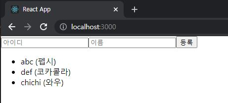
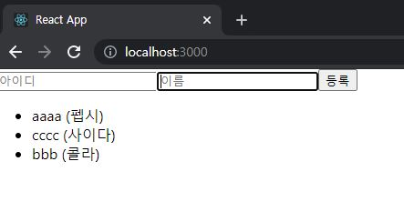

# ReactJS-12 immer

- 전개 연산자와 배열의 내장 함수를 사용하면 간단하게 배열 혹은 객체를 복사하고 새로운 값을 덮어 쓸 수 있다.
- 하지만 객체의 구조가 엄청나게 깊어지면 불변성을 유지하면서 업데이트하는 것이 매우 힘들다.

```javascript
const object = {
    somewhere: {
        deep: {
			inside: 3,
            array: [1, 2, 3, 4]
        },
        bar: 2
    },
    foo: 1
};
```

```javascript
// somewhere.deep.inside 값을 4로 바꾸기
let nextObject = {
    ...object,
    somewhere: {
        ...object.somewhere,
        deep: {
			...object.somewhere.deep,
            inside: 4
        }
    }
};

// somewhere.deep.array에 5 추가하기
let nextObject = {
	...object,
    somewhere: {
        ...object.somewhere,
        deep: {
			...object.somewhere.deep,
            array: object.somewhere.deep.array.concat(5)
        }
    }
};
```

- 값 하나를 없데이트 하기 위해 코드를 열 줄 정도 작성하는 불편한 작업이 있다.
- `immer`이라는 라이브러리를 사용하면, <u>매우 쉽고 짧은 코드를 사용하여 불변성을 유지하면서 업데이트</u>해 줄 수 있다.

---

## 1. immer 설치 및 사용법

```bash
$ yarn add immer
```


### 1-1) immer 사용하지 않고 불변성 유지

```react
// src/App.js
import React, { useRef, useCallback, useState } from 'react';

const App = () => {
  const nextId = useRef(1);
  const [form, setForm] = useState({ name: '', username: '' });
  const [data, setData] = useState({
    array: [],
    uselessValue: null
  });

  // input 수정을 위한 함수
  const onChange = useCallback(
    e => {
      const { name, value } = e.target;
      setForm({
        ...form,
        [name]: [value]
      });
    },
    [form]
  );

  // form 등록을 위한 함수
  const onSubmit = useCallback(
    e => {
      e.preventDefault();
      const info = {
        id: nextId.current,
        name: form.name,
        username: form.username
      };

      // array에 새 항목 등록
      setData({
        ...data,
        array: data.array.concat(info)
      });

      // form 초기화
      setForm({
        name: '',
        username: ''
      });
      nextId.current += 1;
    },
    [data, form.name, form.username]
  );

  // 항목을 삭제하는 함수
  const onRemove = useCallback(
    id => {
      setData({
        ...data,
        array: data.array.filter(info => info.id !== id)
      });
    },
    [data]
  );


  return (
    <div>
      <form onSubmit={onSubmit}>
        <input 
          name="username"
          placeholder="아이디"
          value={form.username}
          onChange={onChange}
        />
        <input 
          name="name"
          placeholder="이름"
          value={form.name}
          onChange={onChange}
        />
        <button type="submit">등록</button>
      </form>
      <div>
        <ul>
          {data.array.map(info => (
            <li key={info.id} onClick={() => onRemove(info.id)}>
              {info.username} ({info.name})
            </li>
          ))}
        </ul>
      </div>
    </div>
  );
};

export default App;
```



- 폼에서 아이디/이름을 입력하면 하단 리스트에 추가
- 리스트 항목을 클릭하면 삭제되는 컴포넌트

---

### 1-2) immer 사용법

- ex1)

```react
import produce from 'immer';
const nextState = produce(originalState, draft => {
	// 바꾸고 싶은 값 바꾸기
	draft.somewhere.deep.inside = 5;
})
```

- `produce`라는 함수는 두 가지 파라미터를 받는다.
  - 첫 번째 파라미터는 **수정하고 싶은 상태**
  - 두 번째 파라미터는 **상태를 어떻게 업데이트할지 정의**
  - 두 번째 파라미터로 전달되는 함수 내부에서 원하는 값을 변경하면, `produce` 함수가 불변성 유지를 대신해 주면서 새로운 상태를 생성해준다.

- ex2)

```react
import produce form 'immer';

const originalState = [
    {
        id: 1,
        todo: '전개 연산자와 배열 내장 함수로 불변성 유지하기',
        checked: true,
    },
    {
        id: 2,
        todo: 'immer로 불변성 유지하기',
        checked: false,
    }
];

const nextState = produce(originalState, draft => {
    // id가 2인 항목의 checked 값을 true로 설정
    const todo = draft.find(t => t.id === 2);	// id로 항목 찾기
    todo.checked = true;
    // 혹은 draft[1].checked = true;
    
    // 배열에 새로운 데이터 추가
    draft.push({
        id: 3,
        todo: '일정 관리 앱에 immer 적용하기',
        checked: false,
    });
    
    // id = 1인 항목을 제거하기
    draft.splice(draft.findIndex(t => t.id === 1), 1);
})
```

---

### 1-3) App 컴포넌트에 immer 적용하기

```react
import React, { useRef, useCallback, useState } from 'react';
import produce from 'immer';

const App = () => {
  ...

  // input 수정을 위한 함수
  const onChange = useCallback(
    e => {
      const { name, value } = e.target;
      setForm(
        produce(form, draft => {
          draft[name] = value;
        })
      );
    },
    [form]
  );

  // form 등록을 위한 함수
  const onSubmit = useCallback(
    e => {
      ...

      // array에 새 항목 등록
      setData(
        produce(data, draft => {
          draft.array.push(info);
        })
      );

      // form 초기화
      ...
    },
    [data, form.name, form.username]
  );

  // 항목을 삭제하는 함수
  const onRemove = useCallback(
    id => {
      setData(
        produce(data, draft => {
          draft.array.splice(draft.array.findIndex(info => info.id === id), 1);
        })
      );
    },
    [data]
  );


  return (
    ...
  );
};

export default App;
```

