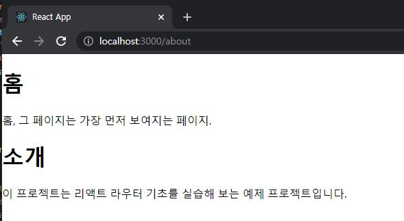

# ReactJS-13 리액트 라우터로 SPA 개발하기


## 1. SPA

> SPA : Single Page Application(한 개의 페이지로 이루어진 애플리케이션)

- 기존에는 사용자가 다른 페이지로 이동할 때마다 새로운 html을 받아 오고, 페이지를 로딩할 때마다 서버에서 리소스를 전달받아 해석한 뒤 화면에 보여주었다.
- 요즘은 웹에서 제공되는 정보가 많기 때문에 새로운 화면을 보여 주어야 할 때마다 서버 측에서 모든 뷰를 준비한다면 **성능상의 문제가 발생**한다.
- 그래서 리액트 같은 라이브러리(혹은 프레임워크)를 사용하여 **뷰 렌더링을 사용자의 브라우저가 담당**하도록 한다.
- SPA의 경우 서버에서 사용자에게 제공하는 페이지는 한 종류이지만, <u>해당 페이지에서 로딩된 자바스크립트와 현재 사용자 브라우저의 주소 상태에 따라 다양한 화면</u>을 보여 줄 수 있다.
- **라우팅**: 다른 주소에 다른 화면을 보여주는 것
  - `react-router`, `reach-router`, `Next.js` 등 여러가지의 리액트 라우팅 라이브러리가 존재

---

### 1-1) SPA의 단점

- 앱의 규모가 커지면 자바스크립트 파일이 너무 커진다.
- 페이지 로딩 시 사용자가 실제로 방문하지 않을 수도 있는 페이지의 스크립트도 불러오기 때문이다.
  - `code splitting` 을 사용하면 라우트별로 파일들을 나누어 트래픽과 로딩 속도를 개선할 수 있다.
- 브라우저에서 자바스크립트를 사용하여 라우팅을 관리하는 것은 자바스크립트를 실행하지 않는 일반 크롤러에서는 페이지의 정보를 제대로 수집해 가지 못한다.
  - 구글, 네이버, 다음 같은 검색 엔진의 검색 결과에 페이지가 잘 나타나지 않을 수 있다.
  - 자바스크립트가 실행될 때까지 페이지가 비어 있기 때문에 자바스크립트 파일이 로딩되어 실행되는 짧은 시간 동안 흰페이지가 나타난다.
  - `server-side rendering`을 통해 해결할 수 있다.

---

## 2. 기본적인 사용법

### 2-1) 라이브러리 설치

- 리액트 라우터 설치

```bash
$ yarn add react-router-dom
```


### 2-2) 프로젝트에 라우터 적용

- src/index.js 파일에서 `react-router-dom` 에 내장되어 있는 `BrowserRouter` 라는 컴포넌트를 사용하여 감싼다.
- 이 컴포넌트는 웹 애플리케이션에 **HTML5의 History API를 사용**하여 페이지를 새로고침하지 않고도 주소를 변경하고, 현재 주소에 관련된 정보를 props로 쉽게 조회하거나 사용할 수 있다.

```react
// src/index.js
...
import { BrowserRouter } from 'react-router-dom';

ReactDOM.render(
  <BrowserRouter>
    <App />
  </BrowserRouter>,
  document.getElementById('root')
);
```


### 2-3) 페이지 만들기

```react
// src/Home.js
import React from 'react';

const Home = () => {
    return (
        <div>
            <h1>홈</h1>
            <p>홈, 그 페이지는 가장 먼저 보여지는 페이지.</p>
        </div>
    );
};

export default Home;
```

```react
// src/About.js
import React from 'react';

const About = () => {
    return (
        <div>
            <h1>소개</h1>
            <p>이 프로젝트는 리액트 라우터 기초를 실습해 보는 예제 프로젝트입니다.</p>
        </div>
    );
};

export default About;
```


### 2-4) Route 컴포넌트로 특정 주소에 컴포넌트 연결

- Route 라는 컴포넌트를 사용하여 어떤 경로에 따라 어떤 컴포넌트를 보여줄지 정의한다.

- ```react
  // 예시
  <Route path="주소규칙" component={보여 줄 컴포넌트} />
  ```

```react
// src/App.js
import React from 'react';
import { Route } from 'react-router-dom'';
import About from './About';
import Home from './Home';

const App = () => {
  return (
    <div>
      <Route path='/' component={Home} />
      <Route path='/about' component={About} />
    </div>
  );
};

export default App;
```



- /about 경로로 들어가면 예상과 다르게 두 컴포넌트가 모두 나타난다.(/about 경로가 / 규칙에도 일치하기 때문)

- `exact` 라는 `props`를 `true`로 설정하면 된다.

  - ```react
    <Route path='/' component={Home} exact={true} />
    ```


### 2-5) Link 컴포넌트를 사용하여 다른 주소로 이동

- `Link` 컴포넌트는 클릭하면 **다른 주소로 이동시켜 주는 컴포넌트**이다.

- 일반 웹 애플리케이션에서는 `a 태그`를 사용하여 페이지를 전환하지만 리액트 라우터를 사용할 때는 이 태그를 사용하면 안된다.

  - `a 태그`는 페이지를 전환하는 과정에서 페이지를 <u>새로 불러오기 때문에 애플리케이션이 들고 있던 상태들을 모두 날려버린다.</u>
  - 렌더링된 컴포넌트들도 모두 사라지고 다시 처음부터 렌더링을 한다.

- `Link` 컴포넌트를 사용하여 페이지를 전환하면, 페이지를 새로 불러오지 않고 애플리케이션은 그대로 유지한 상태에서 HTML5 History API를 사용하여 페이지의 주소만 변경한다. 페이지 전환을 방지하는 기능이 내장되어 있다.

- ```react
  // 예시
  <Link to="주소">내용</Link>
  ```

```react
// src/App.js
...
import { Route, Link } from 'react-router-dom';

const App = () => {
  return (
    <div>
      <ul>
        <li>
          <Link to="/">홈</Link>
        </li>
        <li>
          <Link to="/about">소개</Link>
        </li>
      </ul>
      <hr />
      <Route path='/' component={Home} exact={true} />
      <Route path='/about' component={About} />
    </div>
  );
};

export default App;
```


---

## 3. Route 하나에 여러 개의 path 설정하기

```react
// src/App.js
...

const App = () => {
  return (
    <div>
      ...
      <Route path='/' component={Home} exact={true} />
      <Route path={['/about', '/info']} component={About} />
    </div>
  );
};

export default App;
```

---

## 4. URL 파라미터와 쿼리

- 페이지 주소를 정의할 때 유동적인 값을 전달해야 될 때가 있다.
- 파라미터와 쿼리로 나누어진다.
  - 파라미터 예시: /profile/**chichi**
  - 쿼리 예시: /about?**details=true**
- 일반적으로 파라미터는 특정 아이디 혹은 이름을 사용하여 조회 / 쿼리는 어떤 키워드를 검색하거나 페이지에 필요한 옵션을 전달할 때 사용


### 4-1) URL 파라미터

```react
// src/Profile.js
import React from 'react';

const data = {
    chichi: {
        name: '치치',
        description: '리액트를 공부하는 개발자'
    },
    gildong: {
        name: '홍길동',
        description: '고전 소설 홍길동전의 주인공'
    }
};

const Profile = ({ match }) => {
    const { username } = match.params;
    const profile = data[username];
    if(!profile) {
        return <div>존재하지 않는 사용자입니다.</div>
    }
    return (
        <div>
            <h3>
                {username}({profile.name})
            </h3>
            <p>{profile.description}</p>
        </div>
    );
};

export default Profile;
```

```react
// src/App.js
...
import Profile from './Profile';

const App = () => {
  return (
    <div>
      <ul>
        ...
        <li>
          <Link to='/profile/chichi'>chichi 프로필</Link>
        </li>
        <li>
          <Link to='/profile/gildong'>gildong 프로필</Link>
        </li>
      </ul>
      <hr />
      ...
      <Route path='/profile/:username' component={Profile} />
    </div>
  );
};

export default App;
```


## 4-2) URL 쿼리

- 쿼리는 `location` 객체에 들어 있는 `search` 값에서 조회할 수 있다.

- `location` 객체는 라우트로 사용된 컴포넌트에게 props로 전달되며, 웹 애플리케이션의 현재 주소에 대한 정보를 지니고 있다.

- ```react
  // http://localhost:3000/about?detail=true 주소로 입력했을 때
  // location의 형태
  {
      "pathname": "/about",
      "search": "?detail=true",
      "hash": ""
  }
  ```

- `search` 값에서 특정 값을 읽어 오기 위해서는 이 **문자열을 객체 형태로 변환**해 주어야 한다.

  - 쿼리 문자열을 객체로 변환할 때는 `qs` 라는 라이브러리 사용

  - ```bash
    $ yarn add qs
    ```

```react
// src/About.js
import React from 'react';
import qs from 'qs';

const About = ({ location }) => {
    const query = qs.parse(location.search, {
        ignoreQueryPrefix: true // 이 설정을 통해 문자열 맨 앞의 ?를 생략한다.
    });
    const showDetail = query.detail === 'true'; // 쿼리의 파싱 결과 값은 문자열이다.
    return (
        <div>
            <h1>소개</h1>
            <p>이 프로젝트는 리액트 라우터 기초를 실습해 보는 예제 프로젝트입니다.</p>
            {showDetail && <p>detail 값을 true로 설정했군!</p>}
        </div>
    );
};

export default About;
```


- 쿼리를 사용할 때 쿼리 문자열을 객체로 파싱하는 과정에서 결과 값은 언제나 **문자열**이라는 점을 주의해라!

---

## 5. 서브 라우트

- 라우트 내부에 또 라우트를 정의하는 것
- 라우트로 사용되고 있는 컴포넌트 내부에 Route 컴포넌트를 또 사용하면 된다.

```react
// src/Profiles.js
import React from 'react';
import { Link, Route } from 'react-router-dom';
import Profile from './Profile';

const Profiles = () => {
    return (
        <div>
            <h3>사용자 목록:</h3>
            <ul>
                <li>
                    <Link to="/profiles/chichi">chichi</Link>
                </li>
                <li>
                    <Link to="/profiles/gildong">gildong</Link>
                </li>
            </ul>

            <Route 
                path='/profiles'
                exact
                render={() => <div>사용자를 선택해 주세요.</div>}
            />
            <Route path='/profiles/:username' component={Profile} />

        </div>
    );
};

export default Profiles;
```

- Route 컴포넌트에 component 대신 render 라는 props를 넣어줄 수 있다.
  - 컴포넌트 자체를 전달하는 것이 아니라, 보여주고 싶은 JSX를 넣어 줄 수 있다.
- JSX에서 props를 설정할 때 값을 생략하면 자동으로 true로 설정된다.
  - exact 만 적었는데 exact={true} 와 같은 의미이다.

```react
// src/App.js
import React from 'react';
import { Route, Link } from 'react-router-dom';
import About from './About';
import Home from './Home';
import Profiles from './Profiles';

const App = () => {
  return (
    <div>
      <ul>
        <li>
          <Link to="/">홈</Link>
        </li>
        <li>
          <Link to="/about">소개</Link>
        </li>
        <li>
          <Link to="/profiles">프로필</Link>
        </li>
      </ul>
      <hr />
      <Route path='/' component={Home} exact={true} />
      <Route path={['/about', '/info']} component={About} />
      <Route path='/profiles' component={Profiles} />
    </div>
  );
};

export default App;
```


---

## 6. 리액트 라우터 부가 기능

### 6-1) history

- 라우트로 사용된 컴포넌트에 match, location과 함께 전달되는 props 중 하나로, 이 객체를 통해 컴포넌트 내에 구현하는 메서드에서 라우터  API를 호출할 수 있다.
- 특정 버튼을 눌렀을 때 뒤로 가거나, 로그인 후 화면을 전환하거나, 다른 페이지로 이탈하는 것을 방지해야 할 때 history를 활용한다.


### 6-2) withRouter

- withRouter 함수는 HoC(Higher-order Component) 이다.
- 라우트로 사용된 컴포넌트가 아니어도 match, location, history 객체를 접근할 수 있게 한다.


### 6-3) Switch

- 여러 Route를 감싸서 그 중 일치하는 단 하나의 라우트만을 렌더링시켜 준다.
- Switch를 사용하면 모든 규칙과 일치하지 않을 때 보여 줄 Not Found 페이지도 구현할 수 있다.
