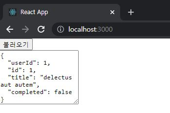
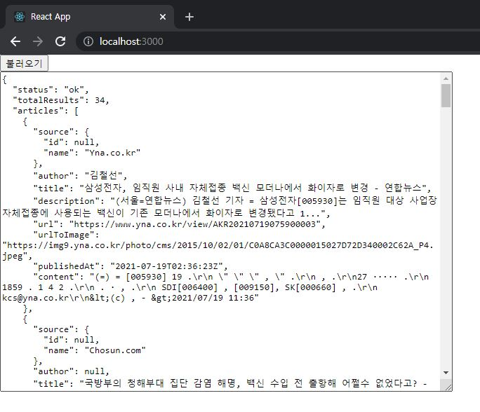
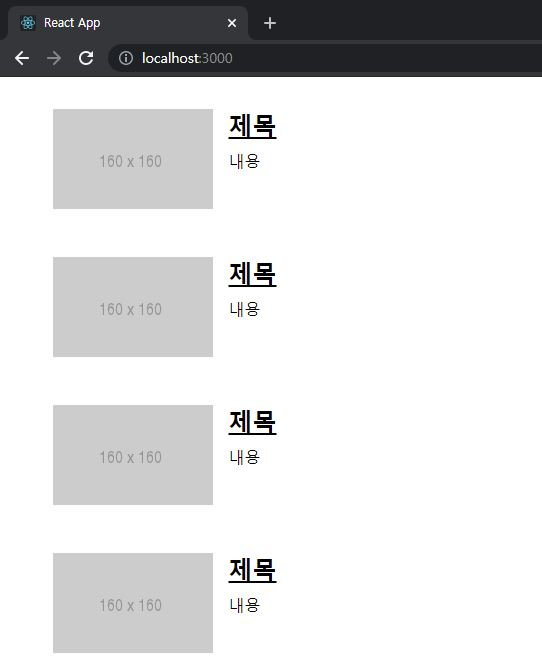
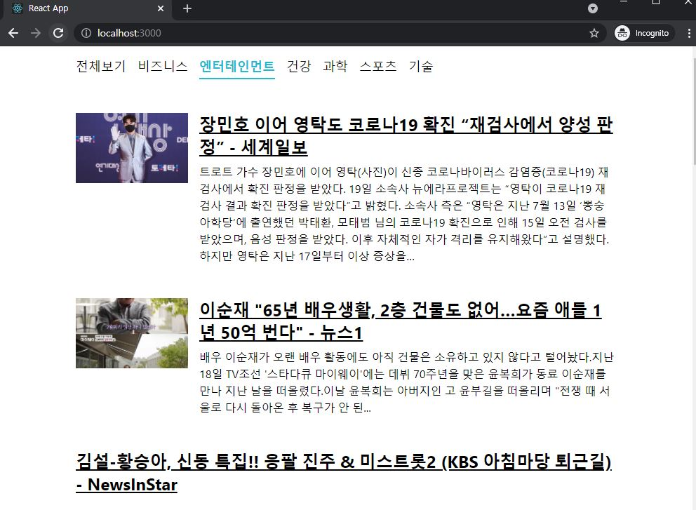

# ReactJS-14 비동기 처리


## 1. 비동기 작업

- 시간이 걸리는 작업을 처리할 때 사용(ex. 네트워크 송수신)
- 자바스크립트에서 비동기 작업을 할 때 흔히 사용하는 방법: 콜백 함수


### 1-1) 콜백 함수

### 1-2) Promise

### 1-3) async/await


## 2. axios로 API 호출해서 데이터 받아오기

- `axios`: 자바스크립트 HTTP 클라이언트(`Promise` 기반으로 처리)

```bash
$ yarn create react-app news-viewer
$ cd news-viewer
$ yarn add axios
```

```react
// src/App.js
import React, { useState } from 'react';
import axios from 'axios';

const App = () => {
  const [data, setData] = useState(null);
  const onClick = () => {
    axios.get('https://jsonplaceholder.typicode.com/todos/1').then(response => {
      setData(response.data);
    });
  };
  return (
    <div>
      <div>
        <button onClick={onClick}>불러오기</button>
      </div>
      {data && <textarea rows={7} value={JSON.stringify(data, null, 2)} readOnly={true} />}      
    </div>
  );
};

export default App;
```



- 위 코드에 async 를 적용

```react
// src/App.js
import React, { useState } from 'react';
import axios from 'axios';

const App = () => {
  const [data, setData] = useState(null);
  const onClick = async () => {
    try {
      const response = await axios.get(
        'https://jsonplaceholder.typicode.com/todos/1',
      );
      setData(response.data);
    } catch (e) {
      console.log(e);
    }
  };
  return (
    ...
  );
};

export default App;
```


## 3. newsapi Key 발급

- [newsapi.org](https://newsapi.org/)
- 사용할 API는 2개
  - 전체 뉴스 불러오기
  - 특정 카테고리 뉴스 불러오기

```react
import React, { useState } from 'react';
import axios from 'axios';

const App = () => {
  const [data, setData] = useState(null);
  const onClick = async () => {
    try {
      const response = await axios.get(
        'https://newsapi.org/v2/top-headlines?country=kr&apiKey=7d2df55b2f384806bce9c1b16f76b712',
      );
      setData(response.data);
    } catch (e) {
      console.log(e);
    }
  };
  return (
    ...
  );
};

export default App;
```



## 4. 뉴스 뷰어 UI 만들기

- styled-components를 사용하여 컴포넌트를 만든다.

  - ```bash
    $ yarn add styled-components
    ```

- 뉴스 데이터 분석

  - title: 제목
  - description: 내용
  - url: 링크
  - urlToImage: 뉴스 이미지


### 4-1) NewsItem.js

```react
// src/components/NewsItem.js
import React from 'react';
import styled from 'styled-components';

const NewsItemBlock = styled.div`
    display: flex;
    .thumbnail {
        margin-right: 1rem;
        img {
            display: block;
            width: 160px;
            height: 100px;
            object-fit: cover;
        }
    }
    .contents {
        h2 {
            margin: 0;
            a {
                color: black;
            }
        }
        p {
            margin: 0;
            line-height: 1.5;
            margin-top: 0.5rem;
            white-space: normal;
        }
    }
    & + & {
        margin-top: 3rem;
    }
`;

const NewsItem = ({ article }) => {
    const { title, description, url, urlToImage } = article;
    return (
        <NewsItemBlock>
            {urlToImage && (
                <div className="thumbnail">
                    <a href={url} target="_blank" rel="noopener noreferrer">
                        
                    </a>
                </div>
            )}
            <div className="contents">
                <h2>
                    <a href={url} target="_blank" rel="noopener noreferrer">
                        {title}
                    </a>
                </h2>
                <p>{description}</p>
            </div>
        </NewsItemBlock>
    );
};

export default NewsItem;
```

### 4-2) NewsList.js

```react
// src/components/NewsList.js
import React from 'react';
import styled from 'styled-components';
import NewsItem from './NewsItem';

const NewsListBlock = styled.div`
    box-sizing: border-box;
    padding-bottom: 3rem;
    width: 768px;
    margin: 0 auto;
    margin-top: 2rem;
    @media screen and (max-width: 768px) {
        width: 100%;
        padding-left: 1rem;
        padding-right: 1rem;
    }
`;

const sampleArticle = {
    title: '제목',
    description: '내용',
    url: 'https://google.com',
    urlToImage: 'https://via.placeholder.com/160',
};

const NewsList = () => {
    return (
        <NewsListBlock>
            <NewsItem article={sampleArticle} />
            <NewsItem article={sampleArticle} />
            <NewsItem article={sampleArticle} />
            <NewsItem article={sampleArticle} />
            <NewsItem article={sampleArticle} />
            <NewsItem article={sampleArticle} />
            <NewsItem article={sampleArticle} />
            <NewsItem article={sampleArticle} />
        </NewsListBlock>
    );
};

export default NewsList;
```

```react
// src/App.js
import React from 'react';
import NewsList from './components/NewsList';

const App = () => {
  return <NewsList />;
};

export default App;
```




## 5. 데이터 연동하기

- 컴포넌트가 화면에 보이는 시점에 API를 요청 => `useEffect` 사용
- 주의할 점은 `useEffect` 에 등록하는 함수에 `async` 를 붙이면 안된다.
  - `useEffect` 에서 반환해야 하는 값은 뒷정리 함수이기 때문
  - async/await 를 사용하고 싶다면, 함수 내부에 async 키워드가 붙은 또 다른 함수를 만들어서 사용

```react
// src/components/NewsList.js
...
import React, { useState, useEffect } from 'react';
import axios from 'axios';

const NewsListBlock = styled.div`
    ...
`;

const NewsList = () => {
    const [articles, setArticles] = useState(null);
    const [loading, setLoading] = useState(false);

    useEffect(() => {
        // async를 사용하는 함수 따로 선언
        const fetchData = async () => {
            setLoading(true);
            try {
                const response = await axios.get(
                    'https://newsapi.org/v2/top-headlines?country=kr&apiKey=7d2df55b2f384806bce9c1b16f76b712',
                );
                setArticles(response.data.articles);
            } catch (e) {
                console.log(e);
            }
            setLoading(false);
        };
        fetchData();
    }, []);

    // 대기 중일 때
    if (loading) {
        return <NewsListBlock>대기 중...</NewsListBlock>
    }
    // 아직 articles 값이 설정되지 않았을 때
    if (!articles) {
        return null;
    }

    // articles 값이 유효할 때
    return (
        <NewsListBlock>
            {articles.map(article => (
                <NewsItem key={article.url} article={article} />
            ))}
        </NewsListBlock>
    );
};

export default NewsList;
```


- `map` 함수를 사용하기 전에 꼭 `!articles` 를 조회하여 해당 값이 <u>현재 null 이 아닌지 검사</u>해야 한다.


## 6. 카테고리 기능 구현

- 뉴스 카테고리는 총 여섯개
  - business, science, entertainment, sports, health, technology

```react
// src/components/Categories.js
import React from 'react';
import styled, { css } from 'styled-components';

const categories = [
  {
    name: 'all',
    text: '전체보기',
  },
  {
    name: 'business',
    text: '비즈니스',
  },
  {
    name: 'entertainment',
    text: '엔터테인먼트',
  },
  {
    name: 'health',
    text: '건강',
  },
  {
    name: 'science',
    text: '과학',
  },
  {
    name: 'sports',
    text: '스포츠',
  },
  {
    name: 'technology',
    text: '기술',
  },
];

const CategoriesBlock = styled.div`
  display: flex;
  padding: 1rem;
  width: 768px;
  margin: 0 auto;
  @media screen and (max-width: 768px) {
    width: 100%;
    overflow-x: auto;
  }
`;

const Category = styled.div`
  font-size: 1.125rem;
  cursor: pointer;
  white-space: pre;
  text-decoration: none;
  color: inherit;
  padding-bottom: 0.25rem;

  &:hover {
    color: #495057;
  }

  ${props => 
    props.active && css`
        font-weight: 600;
        border-bottom: 2px solid #22b8cf;
        color: #22b8cf;
        &:hover {
        color: #3bc9db;
        }
    `}

  & + & {
    margin-left: 1rem;
  }
`;

const Categories = ({ onSelect, category }) => {
  return (
    <CategoriesBlock>
      {categories.map(c => (
        <Category 
            key={c.name}
            active={category === c.name}
            onClick={() => onSelect(c.name)}
        >
          {c.text}
        </Category>
      ))}
    </CategoriesBlock>
  );
};

export default Categories;
```

```react
// src/components/NewsList.js
...

const NewsListBlock = styled.div`
    ...
`;

const NewsList = ({ category }) => {
    ...
    useEffect(() => {
        const fetchData = async () => {
            setLoading(true);
            try {
                const query = category === 'all' ? '' : `&category=${category}`;
                const response = await axios.get(
                    `https://newsapi.org/v2/top-headlines?country=kr${query}&apiKey=7d2df55b2f384806bce9c1b16f76b712`,
                );
                setArticles(response.data.articles);
            } catch (e) {
                console.log(e);
            }
            setLoading(false);
        };
        fetchData();
    }, [category]);

    ...

    // articles 값이 유효할 때
    return (
        ...
    );
};

export default NewsList;
```

```react
// src/App.js
import React, {  useState, useCallback } from 'react';
import NewsList from './components/NewsList';
import Categories from './components/Categories';

const App = () => {
  const [category, setCategory] = useState('all');
  const onSelect = useCallback(category => setCategory(category), []);
  
  return (
    <>
      <Categories category={category} onSelect={onSelect} />
      <NewsList category={category} />
    </>
  );
};

export default App;
```



- category 값이 바뀔 때마다 뉴스를 새로 불러와야 하기 때문에 `useEffect` 의 의존 배열(두번째 파라미터로 설정하는 배열)에 category를 넣어 준다.


## 7. 리액트 라우터 적용

### 7-1) 리액트 라우터의 설치 및 적용

- ```bash
  $ yarn add react-router-dom
  ```

```react
// src/index.js
...
import { BrowserRouter } from 'react-router-dom';

ReactDOM.render(
  <BrowserRouter>
    <App />
  </BrowserRouter>,
  document.getElementById('root')
);
```

### 7-2) NewsPage 생성

```react
// src/pages/NewsPage.js
import React from 'react';
import Categories from '../components/Categories';
import NewsList from '../components/NewsList';

const NewsPage = ({ match }) => {
  // 카테고리가 선택되지 않았으면 기본값 all로 사용
  const category = match.params.category || 'all';

  return (
    <>
      <Categories />
      <NewsList category={category} />
    </>
  );
};

export default NewsPage;
```

```react
// src/App.js
import React from 'react';
import { Route } from 'react-router-dom';
import NewsPage from './pages/NewsPage';

const App = () => {
  return <Route path="/:category?" component={NewsPage} />;
};

export default App;
```

- path에 `/:category?` 와 같은 형태로 맨 뒤에 물음표 문자가 들어간다.
  - 이는 category 값이 선택적이라는 의미
  - 있을 수도 있고 없을 수도 있다는 뜻이다.
  - category URL 파라미터가 없다면 전체 카테고리를 선택한 것으로 간주한다.


### 7-3) Categories 에서 NavLink 사용

```react
import React from 'react';
import styled, { css } from 'styled-components';
import { NavLink } from 'react-router-dom';

const categories = [
  ...
];

const CategoriesBlock = styled.div`
  ...
`;

const Category = styled(NavLink)`
  ...

  &.active {
    font-weight: 600;
    border-bottom: 2px solid #22b8cf;
    color: #22b8cf;
    &:hover {
      color: #3bc9db;
    }
  }

  & + & {
    margin-left: 1rem;
  }
`;

const Categories = ({ onSelect, category }) => {
  return (
    <CategoriesBlock>
      {categories.map(c => (
        <Category 
            key={c.name}
            activeClassName="active"
            exact={c.name === 'all'}
            to={c.name === 'all' ? '/' : `/${c.name}`}
        >
          {c.text}
        </Category>
      ))}
    </CategoriesBlock>
  );
};

export default Categories;
```

- 전체보기 의 경우는 예외적으로 "/all" 대신에 "/" 로 설정
  - to 값이 "/" 를 가리키고 있을 때는 **exact 값을 true**로 해주어야 한다.
  - 이 값을 설정하지 않으면, 다른 카테고리가 선택되었을 때도 전체보기 링크에 active 스타일이 적용되는 오류가 발생


## 8. usePromise 커스텀 Hook 만들기

- 컴포넌트에서 API 호출처럼 Promise 를 사용해야 하는 경우 더욱 간결하게 코드를 작성할 수 있도록 해주는 **커스텀 Hook**을 사용

```react
// src/lib/usePromise.js
import { useState, useEffect } from 'react';

export default function usePromise(promiseCreator, deps) {
  // 로딩중 / 완료 / 실패에 대한 상태 관리
  const [loading, setLoading] = useState(false);
  const [resolved, setResolved] = useState(null);
  const [error, setError] = useState(null);

  useEffect(() => {
    const process = async () => {
      setLoading(true);
      try {
        const resolved = await promiseCreator();
        setResolved(resolved);
      } catch (e) {
        setError(e);
      }
      setLoading(false);
    };
    process();
    // eslint-disable-next-line react-hooks/exhaustive-deps
  }, deps);

  return [loading, resolved, error];
}
```

```react
// src/components/NewsList.js
...
import usePromise from '../lib/usePromise';

const NewsListBlock = styled.div`
  ...
  }
`;

const NewsList = ({ category }) => {
  const [loading, response, error] = usePromise(() => {
    const query = category === 'all' ? '' : `&category=${category}`;
    return axios.get(
      `https://newsapi.org/v2/top-headlines?country=kr${query}&apiKey=0a8c4202385d4ec1bb93b7e277b3c51f`,
    );
  }, [category]);

  // 대기중일 때
  if (loading) {
    return <NewsListBlock>대기중...</NewsListBlock>;
  }
  // 아직 response 값이 설정되지 않았을 때
  if (!response) {
    return null;
  }

  // 에러가 발생했을 때
  if (error) {
    return <NewsListBlock>에러 발생!</NewsListBlock>;
  }

  // response 값이 유효할 때
  const { articles } = response.data;
  return (
    <NewsListBlock>
      {articles.map(article => (
        <NewsItem key={article.url} article={article} />
      ))}
    </NewsListBlock>
  );
};

export default NewsList;
```

- `usePromise` 를 사용하면 NewsList 에서 대기 중 상태 관리와 useEffect 설정을 직접 하지 않아도 되므로 코드가 훨씬 간결해진다.
