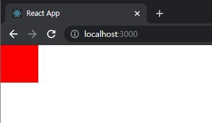
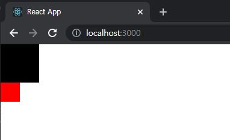
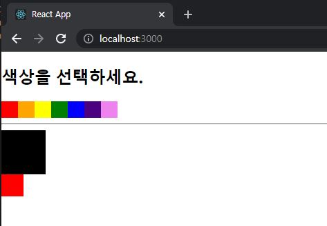
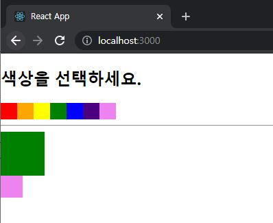

# ReactJS-15 Context API

- Context API는 전역적으로 사용할 데이터가 있을 때 유용한 기능
  - ex) 로그인 정보, 애플리케이션 환경 설정, 테마 등


## 1. Context API를 사용한 전역 상태 관리 흐름

- 프로젝트 내에서 환경 설정, 사용자 정보와 같은 **전역적으로 필요한 상태를 관리**해야 할 때 어떻게 할 것인가
- 컴포넌트 간에 데이터를 props로 전달하기 때문에 컴포넌트 여기저기서 필요한 데이터가 있을 때는 주로 **최상위 컴포넌트인 App**의 `state`에 넣어서 관리한다.

- 다양한 컴포넌트들이 트리 형태로 많은 높이가 쌓였을 때, 컴포넌트 간의 데이터를 전달할 시 매우 비효율적이다.
- 이를 위해, 리덕스나 MobX 같은 상태 관리 라이브러리를 사용하여 전역 상태 관리 작업을 더욱 편하게 처리한다.


## 2. Context API 사용법 익히기

```bash
$ yarn create react-app context-tutorial
```


### 2-1) 새 Context 만들기

```react
// src/contexts/color.js
import { createContext } from 'react';

const ColorContext = createContext({ color: 'black' });

export default ColorContext;
```

- 새로운 Context를 만들 때는 createContext 함수를 사용
  - 파라미터에는 해당 Context의 기본 상태를 저장한다.


### 2-2) Consumer 사용하기

```react
// src/components/ColorBox.js
import React from 'react';
import ColorContext from '../contexts/color';

const ColorBox = () => {
    return (
        <ColorContext.Consumer>
            {value => (
                <div 
                    style={{
                        width: '64px',
                        height: '64px',
                        background: value.color
                    }}

                />

            )}
        </ColorContext.Consumer>
    );
};

export default ColorBox;
```

- ColorBox 라는 컴포넌트를 만들어서 ColorContext 안에 들어 있는 색상을 보여준다. 
- 이때 색상을 `props`로 받아오는 것이 아니라 ColorContext안에 들어 있는 `Consumer` 라는 컴포넌트를 통해 색상을 조회한다.
- `Consumer` 사이에 중괄호를 열어서 그 안에 **함수**를 넣어 준다. 이러한 패턴은 **Function as a child**, 혹은 Render Props 라고 한다.
  - <u>컴포넌트의 children이 있어야 할 자리</u>에 일반 JSX 혹은 문자열이 아닌 **함수**를 전달한다.


```react
// src/App.js
import React from 'react';
import ColorBox from './components/ColorBox';

const App = () => {
  return (
    <div>
      <ColorBox />
    </div>
  );
};

export default App;
```


### 2-3) Provider

- `Provider`를 사용하면 **Context의 value를 변경**할 수 있다.

```react
// src/App.js
import React from 'react';
import ColorBox from './components/ColorBox';
import ColorContext from './contexts/color';

const App = () => {
  return (
    <ColorContext.Provider value={{ color: 'red' }}>
      <div>
        <ColorBox />
      </div>
    </ColorContext.Provider>
  );
};

export default App;
```



- 기존에 `createContext` 함수를 사용할 때는 파라미터로 **Context의 기본값**을 넣어 주었다.

  - 이 기본값은 `Provider`를 <u>사용하지 않았을 때만 사용</u>된다.

  - 만약 `Provider`는 사용했는데 value를 명시하지 않았다면, 이 기본값을 사용하지 않기 때문에 오류가 발생

  - ```react
    // 다음과 같은 경우는 오류가 발생한다.
    // src/App.js
    ...
    
    const App = () => {
      return (
        <ColorContext.Provider>
        ...
        </ColorContext.Provider>
      );
    };
    
    export default App;
    ```

  - Provider 를 사용할 때는 value 값을 명시해 주어야 한다!


## 3. 동적 Context 사용하기


### 3-1) Context 파일 수정

- Context 의 value에는 무조건 상태 값만 있어야 하는 것은 아니다. 함수를 전달해 줄 수도 있다.

```react
// src/contexts/color.js
import { createContext, useState } from 'react';

const ColorContext = createContext({ 
    state: { color: 'black', subcolor: 'red' },
    actions: {
        setColor: () => {},
        setSubcolor: () => {}
    }
});

const ColorProvider = ({ children }) => {
    const [color, setColor] = useState('black');
    const [subcolor, setSubcolor] = useState('red');

    const value = {
        state: { color: subcolor },
        actions: { setColor, setSubcolor }
    };

    return (
        <ColorContext.Provider value={value}>{children}</ColorContext.Provider>
    );
};

// const ColorConsumer = ColorContext.Consumer 와 같은 의미
const { Consumer: ColorConsumer } = ColorContext;

// ColorProvider와 ColorConsumer 내보내기
export { ColorProvider, ColorConsumer };

export default ColorContext;
```

- ColorProvider 라는 컴포넌트를 새로 작성해주고 ColorContext.Provider를 렌더링해준다.


### 3-2) Context를 프로젝트에 반영

```react
src/App.js
...
import { ColorProvider } from './contexts/color';

const App = () => {
  return (
    <ColorProvider>
      ...
    </ColorProvider>
  );
};

export default App;
```

```react
// src/components/ColorBox.js
import React from 'react';
import { ColorConsumer } from '../contexts/color';

const ColorBox = () => {
    return (
        <ColorConsumer>
            {({ state }) => (
                <>
                    <div 
                    style={{
                        width: '64px',
                        height: '64px',
                        background: state.color
                    }}

                />
                <div 
                    style={{
                        width: '32px',
                        height: '32px',
                        background: state.subcolor
                    }}

                />
                </>
            )}
        </ColorConsumer>
    );
};

export default ColorBox;
```




### 3-3) 색상 컴포넌트 만들기

- Context의 actions에 넣어 준 함수를 호출하는 컴포넌트를 만든다.

```react
// src/components/SelectColor.js
import React from 'react';

const colors = ['red', 'orange', 'yellow', 'green', 'blue', 'indigo', 'violet'];

const SelectColors = () => {
    return (
        <div>
            <h2>색상을 선택하세요.</h2>
            <div style={{ display: 'flex' }}>
                {colors.map(color => (
                    <div 
                        key={color}
                        style={{
                            background: color,
                            width: '24px',
                            height: '24px',
                            cursor: 'pointer'
                        }}
                    />
                ))}
            </div>
            <hr />
        </div>
    );
};

export default SelectColors;
```

```react
...
import SelectColors from './components/SelectColors';

const App = () => {
  return (
    <ColorProvider>
      <div>
        <SelectColors />
        <ColorBox />
    </div>
    </ColorProvider>
  );
};

export default App;
```




- 해당 SelectColors 에서 마우스 왼쪽 버튼을 클릭하면 큰 정사각형의 색상을 변경
- 마우스 오른쪽 버튼을 클릭하면 작은 정사각형의 색상을 변경

```react
import React from 'react';
import { ColorConsumer } from '../contexts/color';

const colors = ['red', 'orange', 'yellow', 'green', 'blue', 'indigo', 'violet'];

const SelectColors = () => {
    return (
        <div>
            <h2>색상을 선택하세요.</h2>
            <ColorConsumer>
            {({ actions }) => (
                <div style={{ display: 'flex' }}>
                {colors.map(color => (
                    <div 
                        key={color}
                        style={{
                            background: color,
                            width: '24px',
                            height: '24px',
                            cursor: 'pointer'
                        }}
                        onClick={() => actions.setColor(color)}
                        onContextMenu={e => {
                            e.preventDefault(); // 마우스 오른쪽 버튼 클릭시 메뉴가 뜨는 것을 무시함
                            actions.setSubcolor(color);
                        }}
                    />
                ))}
                </div>
            )}
            </ColorConsumer>
            
            <hr />
        </div>
    );
};

export default SelectColors;
```

- 마우스 오른쪽 버튼 클릭 이벤트는 `onContextMenu` 를 사용
  - 오른쪽 클릭 시 원래 브라우저 메뉴가 나타나지만, 여기서 `e.preventDefault()` 를 호출하면 메뉴가 뜨지 않는다.




## 4. Consumer 대신 Hook 또는 static contextType 사용


### 4-1) useContext Hook 사용

- 리액트에 내장되어 있는 Hooks 중 useContext 사용

```react
// src/components/COlorBox.js
import React, { useContext } from 'react';
import ColorContext from '../contexts/color';

const ColorBox = () => {
    const { state } = useContext(ColorContext);
    return (
        <>
            <div 
                style={{
                    width: '64px',
                    height: '64px',
                    background: state.color
                }}

            />
            <div 
                style={{
                    width: '32px',
                    height: '32px',
                    background: state.subcolor
                }}
            />
        </>    
    );
};

export default ColorBox;
```


### 4-2) static contextType 사용

- 클래스형 컴포넌트에서 Context 를 좀 더 쉽게 사용하고 싶다면 static contextType 사용

```react
import React, { Component } from 'react';
import ColorContext from '../contexts/color';

const colors = ['red', 'orange', 'yellow', 'green', 'blue', 'indigo', 'violet'];

class SelectColors extends Component {
    static contextType = ColorContext;

    handleSetColor = color => {
        this.context.actions.setColor(color);
    }

    handleSetSubcolor = subcolor => {
        this.context.actions.setSubcolor(subcolor);
    }

    render() {
        return (
            <div>
                <h2>색상을 선택하세요.</h2>
                <div style={{ display: 'flex' }}>
                    {colors.map(color => (
                        <div 
                            key={color}
                            style={{
                                background: color,
                                width: '24px',
                                height: '24px',
                                cursor: 'pointer'
                            }}
                            onClick={() => this.handleSetColor(color)}
                            onContextMenu={e => {
                                e.preventDefault(); // 마우스 오른쪽 버튼 클릭시 메뉴가 뜨는 것을 무시함
                                this.handleSetSubcolor(color);
                            }}
                        />
                    ))}
                </div>
                <hr />
            </div>
        );
    }
}

export default SelectColors;
```

- 클래스 상단에 `static contextType` 값을 지정
- `this.context` 를 조회했을 때 **현재 Context의 value**를 가르킨다.
- 만약에 setColor 를 호출하고 싶다면 `this.context.actions.setColor` 를 호출
- 단점은 <u>한 클래스에서 하나의 Context 밖에 사용하지 못한다.</u>

